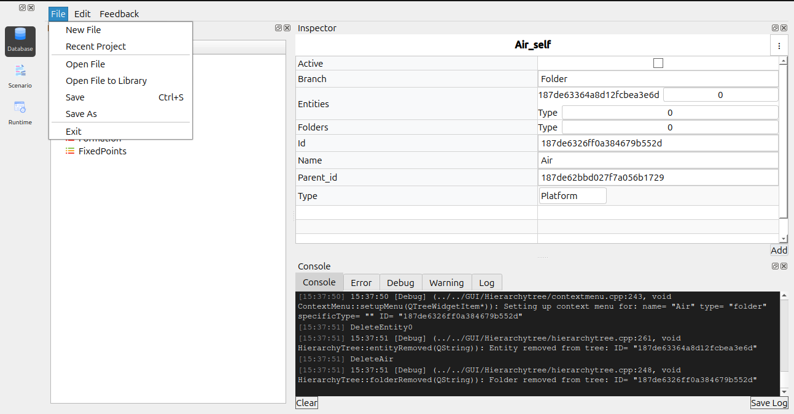
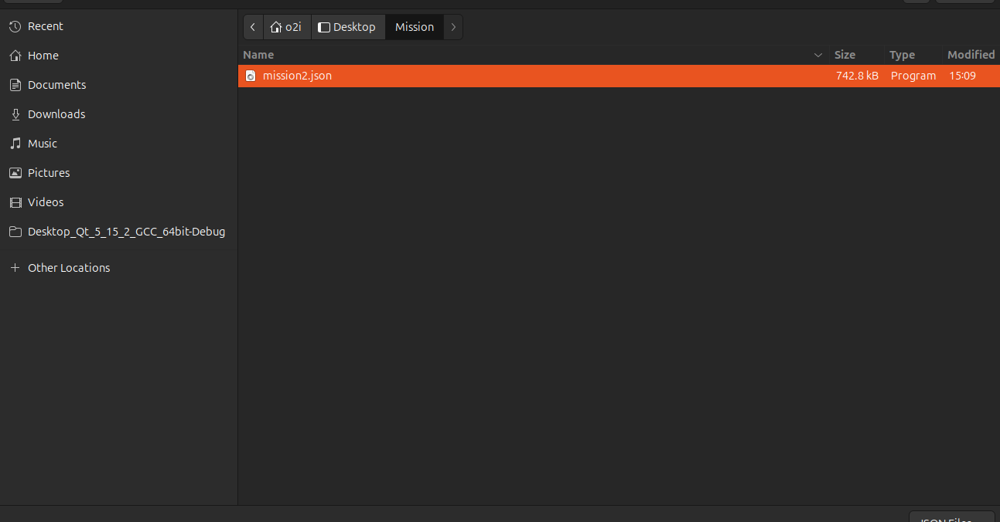
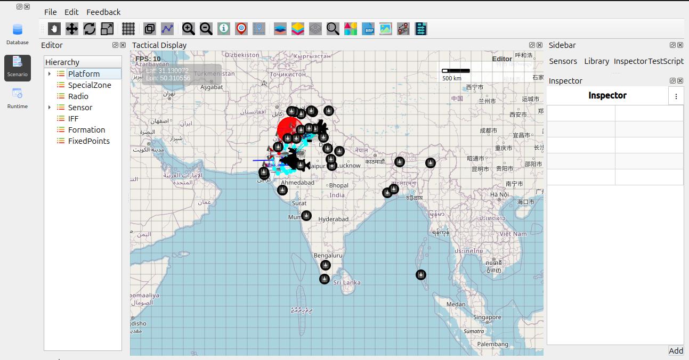
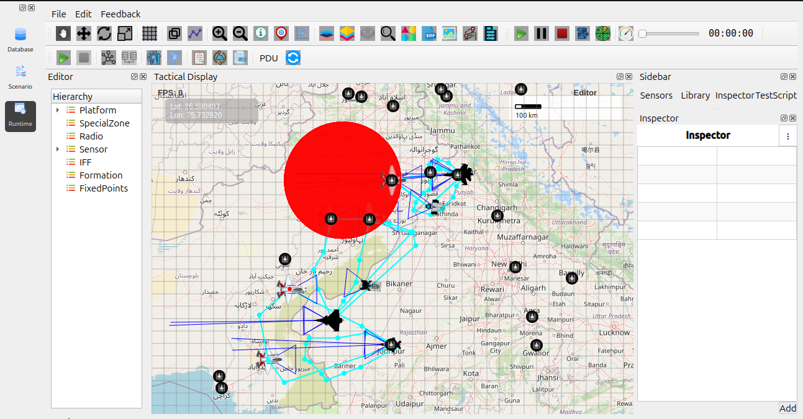

Getting started
===============

Opening and Running a Scenario
------------------------------

This section describes the workflow for loading a scenario, configuring it, and executing the simulation using the Database Editor, Scenario Editor, and Runtime Editor.

Steps to Load and Run a Scenario
~~~~~~~~~~~~~~~~~~~~~~~~~~~~~~~~

1. Open the Scenario File

2. Navigate to the Database Editor.

3. From the top menu, click File → Open File.

4. A file browser window will appear.

5. Select the required .json scenario file and click Open to load it.

6. Modify Scenario in Scenario Editor

7. Switch to the Scenario tab/editor.

8. Configure or modify the scenario as required (platforms, routes, sensors, IFF, zones, etc.).

   - The tactical display will update with your modifications.

9.Run the Simulation

10. Switch to the Runtime Editor.

11. Click the Run button to start the simulation.

12. The scenario will execute based on configured paths, behaviors, and interactions.

