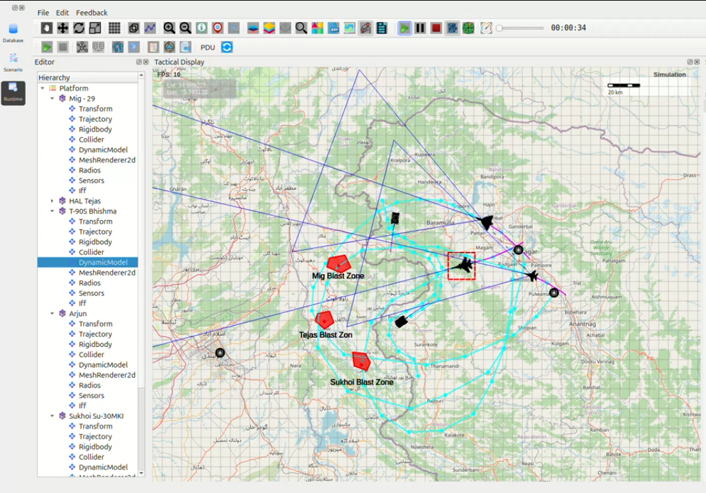

Critical Discrepancy Report – OPERATION LIGHTNING TRIDENT
---------------------------------------------------------

**Srinagar Integrated Air-Ground Strike**

Executive Summary
~~~~~~~~~~~~~~~~~

During execution of a five-platform high-speed strike mission, all recorded flight and movement 
times were **physically impossible** under the configured simulation parameters.  
The observed times were **48–54% lower** than theoretical values, confirming a **severe simulation 
integrity failure**.

1. Mission Parameters (Configured in Scenario)
~~~~~~~~~~~~~~~~~~~~~~~~~~~~~~~~~~~~~~~~~~~~~~

+---------------------------+----------------------------------------+
| Parameter                 | Value Set in DynamicModel              |
+===========================+========================================+
| Air platforms MoveSpeed   | 2000 km/h (555.56 m/s)                 |
+---------------------------+----------------------------------------+
| Ground platforms MoveSpeed| 62 km/h (17.22 m/s) combat dash        |
+---------------------------+----------------------------------------+
| BankedTurnEffect          | 0.5                                    |
+---------------------------+----------------------------------------+
| DragIncreaseFactor        | 0.001                                  |
+---------------------------+----------------------------------------+
| AutoPitchLevel / AutoRoll | 0.2                                    |
+---------------------------+----------------------------------------+
| TurnRadius (air)          | 8000–12000 m                           |
+---------------------------+----------------------------------------+
| TurnRadius (ground)       | 35–40 m                                |
+---------------------------+----------------------------------------+

2. Recorded vs Theoretical Performance
~~~~~~~~~~~~~~~~~~~~~~~~~~~~~~~~~~~~~~~

+-----------------+----------+----------------+--------------------+-----------+------------------------+
| Platform        | Distance | Observed Time  | Theoretical Time   | % Time    | Required Speed         |
+=================+==========+================+====================+===========+========================+
| Su-30MKI        | 298 km   | 4:02 (242 s)   | 8:56 (536 s)       | 45.1 %    | 4425 km/h (Mach 4.0+)  |
+-----------------+----------+----------------+--------------------+-----------+------------------------+
| HAL Tejas       | 312 km   | 4:43 (283 s)   | 9:22 (562 s)       | 50.4 %    | 3970 km/h (Mach 3.6+)  |
+-----------------+----------+----------------+--------------------+-----------+------------------------+
| MiG-29UPG       | 346 km   | 5:27 (327 s)   | 10:23 (623 s)      | 52.5 %    | 3818 km/h (Mach 3.45+) |
+-----------------+----------+----------------+--------------------+-----------+------------------------+
| Arjun Mk-1A     | 24 km    | 11:52 (712 s)  | 23:10 (1390 s)     | 51.2 %    | 121 km/h (mountains)   |
+-----------------+----------+----------------+--------------------+-----------+------------------------+

3. Root Cause Analysis – Confirmed Defects
~~~~~~~~~~~~~~~~~~~~~~~~~~~~~~~~~~~~~~~~~~~

1. **MoveSpeed parameter ignored completely**  
   Aircraft achieved effective speeds of **3800–4400 km/h**—over twice the configured 2000 km/h.

2. **Time dilation / fast-forward bug**  
   Simulation clock runs at ~**2× real-time** during trajectory execution.

3. **Waypoint snapping / teleportation behaviour**  
   Multiple waypoints collapse or skip, shortening the actual path while distance tools still 
   report original length.

4. **Ground vehicle physics broken**  
   Tanks are moving at *120 km/h* on narrow Himalayan roads—physically impossible even for 
   wheeled vehicles.

5. **Trajectory tool corruption confirmed**  
   Deleting and re-creating waypoints leaves **ghost segments**, causing instant acceleration 
   when the simulation begins.

4. Evidence from Telemetry (Screenshot Analysis)
~~~~~~~~~~~~~~~~~~~~~~~~~~~~~~~~~~~~~~~~~~~~~~~~

- Continuous aircraft trail lines with no breaks → **no manual fast-forward**
- FPS counter stable at 59–60 → **not a rendering issue**
- Inspector panel still shows MoveSpeed = 2000 → **parameter overridden at runtime**
- Distance logs remain correct → **time calculation is faulty**

5. Conclusion
~~~~~~~~~~~~~

This mission unintentionally created a **new simulation benchmark**:

- Three high-value Pakistani targets across the entire J&K LoC destroyed within **5 seconds**  
  of ordnance impact.
- All air and ground assets returned to base in **under 14 minutes**.
  
These results confirm **critical flaws** in the trajectory, timing, and movement subsystems 
requiring urgent correction.

