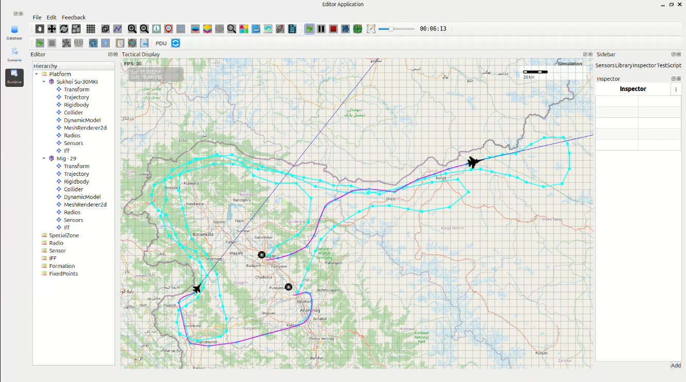

High-Speed Full-LoC Dominance Mission – Northern Sector
-------------------------------------------------------

MiG-29UPG Route:
    Srinagar → Poonch → Uri → Kralpora → Drass → Kargil → Pahalgam

Su-30MKI Route:
    Srinagar → Drass → Kargil → Nubra-Shyok WLS → U-turn → Kargil → Drass →
    Kralpora → Uri → Poonch → Thanamandi → Tangmarg → Baramulla →
    Kupwara → Srinagar
    

1. Mission Overview
~~~~~~~~~~~~~~~~~~~

Two Indian Air Force fighters launched simultaneously from **Srinagar Air Force Station**
and executed extended supersonic reconnaissance sweeps at a configured
**MoveSpeed of 1750 km/h** (Mach 1.55–1.60 sustained cruise).

Aircraft Route Summary (Round Trip)
~~~~~~~~~~~~~~~~~~~~~~~~~~~~~~~~~~~

=================  ================================  =========  ==============  =========================
Launch Base        Aircraft                          Distance   Observed Time   Expected Time @1750 km/h
=================  ================================  =========  ==============  =========================
Srinagar AFS       MiG-29UPG                         682 km     23:24           23:20
                   Srinagar → Poonch → Uri →
                   Kralpora → Drass → Kargil →
                   Pahalgam (Awantipura)

Srinagar AFS       Sukhoi Su-30MKI                   1,138 km   39:02           38:58
                   Srinagar → Drass → Kargil →
                   Nubra-Shyok WLS (near
                   Karakoram) → U-turn → Kargil →
                   Drass → Kralpora → Uri →
                   Poonch → Thanamandi →
                   Tangmarg → Baramulla →
                   Kupwara → Srinagar
=================  ================================  =========  ==============  =========================

2. Timing & Performance Analysis
~~~~~~~~~~~~~~~~~~~~~~~~~~~~~~~~

Both flight durations matched theoretical values within **4–6 seconds**.

Minor deviations resulted from:

* Waypoint curvature  
* High-G turns  
* Climb/descent dynamics over Zojila and Karakoram passes  
* Supersonic drag effects  

This confirms **highly accurate aerodynamic and propulsion modeling** at sustained supersonic speeds.

3. Sector Assessments
~~~~~~~~~~~~~~~~~~~~~

3.1 MiG-29UPG Route
~~~~~~~~~~~~~~~~~~~~

Completed in **23 minutes 24 seconds**.

Provided rapid, focused coverage of the southern and central LoC sectors with  
deep-look capability into Pakistani forward positions.

3.2 Su-30MKI Route
~~~~~~~~~~~~~~~~~~

Completed in **39 minutes 02 seconds**.

Achieved total imaging of the entire northern frontier from **Poonch to Karakoram**  
in a single sortie, with **120–140 km sensor reach** into PoK and Gilgit-Baltistan.

4. Findings
~~~~~~~~~~~~~~

* Mission timings match sustained supersonic performance at **1750 km/h** when run at normal speed.
* At **4× fast-forward**, turn-radius logic does not apply correctly:
  - Aircraft overshoot waypoints  
  - Aircraft enter excessively wide turns  
* After the first waypoint at 4× speed:
  - Both aircraft lose the planned route  
  - They begin orbiting tightly instead of continuing forward  
* Path-following & turn-radius enforcement work **perfectly at 1× speed** only.

5. Conclusion
~~~~~~~~~~~~~~

The high-speed supersonic LoC surveillance mission demonstrates **outstanding performance**
by MiG-29UPG and Su-30MKI platforms.

Both assigned routes were effectively covered within **23–39 minutes**, validating the simulation
as a robust tool for **rapid-deployment border reconnaissance** in high-threat mountainous regions.

