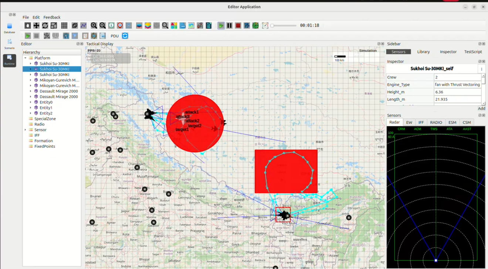

Indian Air Force Multi-Front Offensive Operation – Case Study
-------------------------------------------------------------

This case study presents a **simulated multi-front offensive mission** executed by the 
**Indian Air Force (IAF)** across two strategic theatres:

1. The Northern Front along Ladakh bordering the LAC  
2. The North-Eastern Front near the Darjeeling–Sikkim sector  

The mission objective is the **destruction of hostile Chinese military installations**, 
suppression of enemy air activity, and demonstration of India's **deep-strike capability**.

1. Operational Context
~~~~~~~~~~~~~~~~~~~~~~

China has reinforced its forward military structures across the LAC, including:

- Radar surveillance sites
- Artillery deployment zones
- Forward operating camps

Concurrently, military buildup and activity in the **Chumbi Valley** region poses 
a strategic risk to India's **North-Eastern corridor near Darjeeling**.

In response, India executes a **coordinated multi-axis offensive** using:

- **Sukhoi Su-30MKI** – Long-range air superiority and strike
- **Dassault Mirage-2000** – Precision deep-strike platform

2. Target Sectors
~~~~~~~~~~~~~~~~

Two major Chinese target zones are designated within the simulated operation:

- **Target Zone A – Ladakh (Northern Front)**  
  High-value enemy assets including supply depots, artillery staging points, 
  and fortified positions.

- **Target Zone B – North-East (Darjeeling–Sikkim Sector)**  
  Radar stations, missile batteries, and tactical infrastructure across the border.

Each red circular region in the simulation represents an **active strike zone** containing:

- Sub-targets (attack1, attack2, attack3)
- Critical infrastructure (target1, target2)

3. Indian Air Asset Deployment
~~~~~~~~~~~~~~~~~~~~~~~~~~~~~~

The IAF deploys a **mixed strike package**:

- **Su-30MKI aircraft** penetrate and engage northern targets beyond the LAC.
- **Mirage-2000 aircraft** perform precision strike runs on eastern defensive structures.

Aircraft follow:

- High-speed attack corridors
- Low-altitude radar-evading paths
- Defensive looping maneuvers inside contested airspace

4. Mission Execution
~~~~~~~~~~~~~~~~~~~~~~

**Phase 1 – Northern Front Offensive**

- Su-30MKI fighters strike Chinese military positions inside the Ladakh region.
- Multiple attack vectors saturate defenses and neutralize critical assets.

**Phase 2 – North-Eastern Offensive**

- Mirage-2000 aircraft conduct deep-strike operations near the Chumbi Valley.
- Looping strike patterns maintain continuous pressure on Chinese defenses.

**Phase 3 – Post-Strike Air Superiority**

- Both aircraft regroup while retaining control of the airspace.
- Enemy fighters and ground-based intercept attempts are prevented.

5. Outcome
~~~~~~~~~~

- All designated Chinese targets were **successfully destroyed**.
- No enemy aircraft penetrated Indian airspace during the mission.
- High survivability and precision were demonstrated in **multi-front offensive warfare**.
- Deep penetration was achieved simultaneously on two operational axes.

Conclusion
~~~~~~~~~~

The operation validates India’s capability to execute **simultaneous multi-front offensive missions** 
with high accuracy and coordinated fighter integration. The combined strike strength of **Su-30MKI** 
and **Mirage-2000** ensures effective deterrence and rapid neutralization of hostile infrastructure 
across extended theatres.

Simulation Image
~~~~~~~~~~~~~~~~

