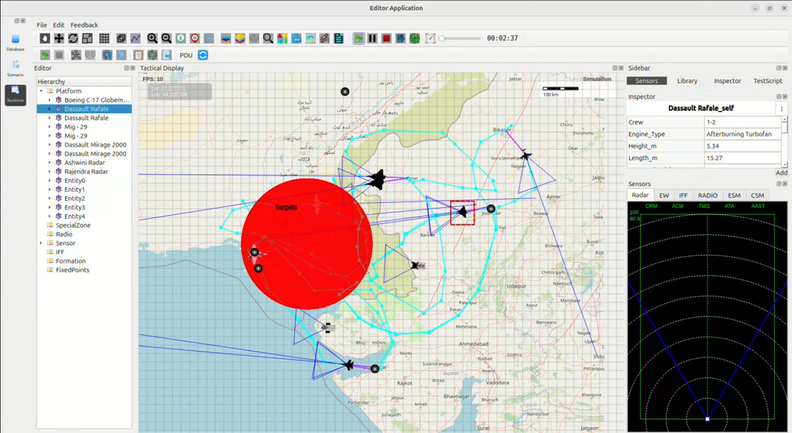

Indian Air Force Cross-Border Strike on Pakistani Airbase – Case Study
----------------------------------------------------------------------

This case study analyzes a simulated **Indian Air Force (IAF)** offensive operation targeting a 
major Pakistani airbase located near the **Sindh–Gujarat border**. The strike is executed using 
Dassault Rafale, Dassault Mirage 2000, and MiG-29 aircraft launched from forward airbases in 
Gujarat and Rajasthan.

1. Mission Objective
~~~~~~~~~~~~~~~~~~~~

The primary goals of the cross-border strike operation were to:

- Enter Pakistani airspace undetected
- Neutralize high-value military assets
- Destroy grounded aircraft and hangars
- Cripple radar and air-defense capability
- Demonstrate India’s precision-strike readiness in the western theatre

2. Strike Package Composition
~~~~~~~~~~~~~~~~~~~~~~~~~~~~~

The strike mission was executed through a **multi-role aircraft composition**:

- **Dassault Rafale** – Deep strike + high-altitude air dominance
- **Dassault Mirage 2000** – Surgical precision bombing
- **MiG-29 UPG** – Escort and Suppression of Enemy Air Defenses (SEAD)

These aircraft were deployed from:

- Jodhpur Airbase
- Jaisalmer Airbase
- Forward airbases in Gujarat sectors

3. Target & Strike Zone
~~~~~~~~~~~~~~~~~~~~~~~

The large **red circular zone** represents the Pakistani airbase and associated military 
infrastructure. Key strike points within this zone include:

- Command and control centers
- Fuel storage depots
- Aircraft hangars and grounded fighters
- Radar and surveillance installations
- Tactical logistics hubs

4. Tactical Insights from Flight Paths
~~~~~~~~~~~~~~~~~~~~~~~~~~~~~~~~~~~~~~

The colored paths (cyan, purple, blue) visible in the simulation represent:

- Low-altitude radar evasion maneuvers
- Multi-axis ingress routes overwhelming defensive systems
- High-speed penetration loops
- Coordinated Mirage-based precision strike runs

5. Mission Phases
~~~~~~~~~~~~~~~~~

- **Phase 1 – Ingress**  
  Fighters approach the border at low altitude, maintaining stealth flight profiles.

- **Phase 2 – Penetration**  
  Rafale and Mirage aircraft enter the strike zone from separate vectors, dividing 
  Pakistani air-defense focus.

- **Phase 3 – Strike**  
  Mirage 2000 deploys precision-guided munitions while Rafale provides top cover and 
  MiG-29 suppresses enemy radar and SAM elements.

- **Phase 4 – Withdrawal**  
  Aircraft exit via secured air corridors; no losses recorded.

6. Mission Outcome
~~~~~~~~~~~~~~~~~~~

- All assigned Pakistani targets were **successfully destroyed**.
- Enemy radar and SAM networks were **saturated and degraded**.
- **Zero aircraft losses** for the Indian Air Force.
- The operation validated India’s capability to conduct **deep, accurate cross-border strikes**.

Simulation Image
~~~~~~~~~~~~~~~~

