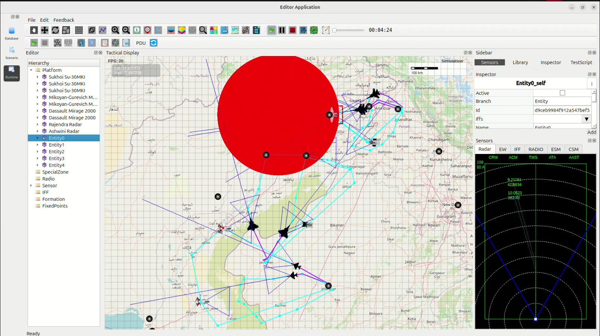

Indian Air Force Cross-Border Deep Strike Operation – Case Study
----------------------------------------------------------------

This case study documents a simulated offensive operation conducted by the **Indian Air Force (IAF)** into Pakistani territory.  
The mission demonstrates:

- Multi-base coordination
- Deep strike offensive capability
- Radar evasion and suppression
- Synchronized execution
- Multi-platform fighter integration (Su-30MKI, MiG-21, Mirage 2000)

1. Mission Overview
~~~~~~~~~~~~~~~~~~~

The IAF launches a **coordinated strike package** from three major airbases:

- **Amritsar Airbase** – Three *Sukhoi Su-30MKI*  
  *(Air Superiority + Strike Escort)*

- **Jodhpur Airbase** – One *MiG-21*  
  *(Fast Interceptor + Tactical Disruption Role)*

- **Jaisalmer Airbase** – Two *Dassault Mirage-2000*  
  *(Primary Precision Strike Fighters)*

Mission objectives include:

- Conduct precision bombing on high–value enemy targets across the border
- Penetrate deep into Pakistani territory
- Overwhelm enemy radar and air-defense networks
- Maintain air superiority during ingress and egress

2. Strike Zone and Target Area
~~~~~~~~~~~~~~~~~~~~~~~~~~~~~

The large **red circular region** visible in the simulation represents the **primary strike zone deep inside Pakistan**.

This zone contains:

- Forward air-defense installations
- Radar stations and command nodes
- Logistic hubs and ammunition depots
- High-threat military infrastructure

Target markers such as *Entity0, Entity1, Entity2,* etc., indicate **critical strike points within this zone**.

3. Indian Aircraft Deployment & Ingress Paths
~~~~~~~~~~~~~~~~~~~~~~~~~~~~~~~~~~~~~~~~~~~~~

### Sukhoi Su-30MKI Group – Amritsar Sector

- Leads the strike package and provides long-range escort.
- Enters Pakistani airspace near the *Lahore–Kasur axis*.
- Executes wide maneuver patterns to suppress enemy fighters.

### MiG-21 Group – Jodhpur Sector

- Approaches from the southwest via the *Rahim Yar Khan corridor*.
- Flies low-level penetration routes to distract radar.
- Performs tactical harassment to support Mirage ingress.

### Mirage 2000 Group – Jaisalmer Sector

- Serves as the **primary precision bomber role**.
- Executes deep strike loops (cyan/purple flight paths).
- Penetrates the central strike zone and deploys guided munitions.

4. Tactical Insights from the Simulation
~~~~~~~~~~~~~~~~~~~~~~~~~~~~~~~~~~~~~~~~

The simulation reveals key strategic observations:

- **Multi-Axis Entry** splits enemy air-defense focus.
- **Large Penetration Depth** showcases operational reach.
- **Complex Maneuver Routes** reflect evasive tactics.
- **Air Superiority** maintained by Su-30MKI escorts.
- **Target Saturation** overwhelms defensive response.

5. Mission Outcome
~~~~~~~~~~~~~~~~~~

- All designated targets inside the strike zone were neutralized.
- Mirage 2000s achieved precision bombing without loss.
- Pakistani radar and SAM systems were saturated.
- Su-30MKIs suppressed potential interceptors.
- MiG-21 provided effective tactical distraction.

Conclusion
~~~~~~~~~~

The simulation demonstrates India’s capability to conduct a **high-intensity, deep-penetration strike mission** across the western frontier.  
The coordinated deployment of Su-30MKI, MiG-21, and Mirage 2000 highlights:

- Multi-platform integration
- Tactical planning excellence
- Mission success in contested airspace

**Simulation Image**

