GIS Canvas Scripting Guide
============================

This document explains how to write and run Behaviour Scripts inside the
Scenario Editor and Runtime Editor. It focuses on Canvas and GIS-related scripting functions
such as adding shapes, switching maps, and generating PDF reports.

-----------------------------------------
Script Entry Point
-----------------------------------------

Every behaviour script must define a ``main`` function.

.. code-block:: cpp

   void main(ScriptEngine@ e)
   {
       // Script logic here
   }

-----------------------------------------
Setting City Context
-----------------------------------------

Before drawing Circle and Rectangle object, you should define the city context.

**Syntax**

.. code-block:: cpp

   e.useCity("CityName");

**Example**

.. code-block:: cpp

   void main(ScriptEngine@ e)
   {
       e.useCity("Bhopal");
   }

**Explanation**

- Loads GIS and map data for the specified city.
- Canvas objects are plotted within this context.

-----------------------------------------
Adding a Circle
-----------------------------------------

The ``canvasAddCircle`` function draws a circular shape on the canvas.

**Syntax**

.. code-block:: cpp

   e.canvasAddCircle(string name, float radius);

**Parameters**

- ``name`` – Unique identifier for the circle.  
- ``radius`` – Radius of the circle.

**Example**

.. code-block:: cpp

   void main(ScriptEngine@ e)
   {
       e.useCity("Bhopal");

       // Add circle on canvas
       e.canvasAddCircle("Circle", 10.0);

       // Generate PDF report
       e.generatePDFReport("GIS_Report_circle.pdf");
   }

**Explanation**

- Creates a circular GIS overlay.
- Useful for range, coverage, or zone visualization.

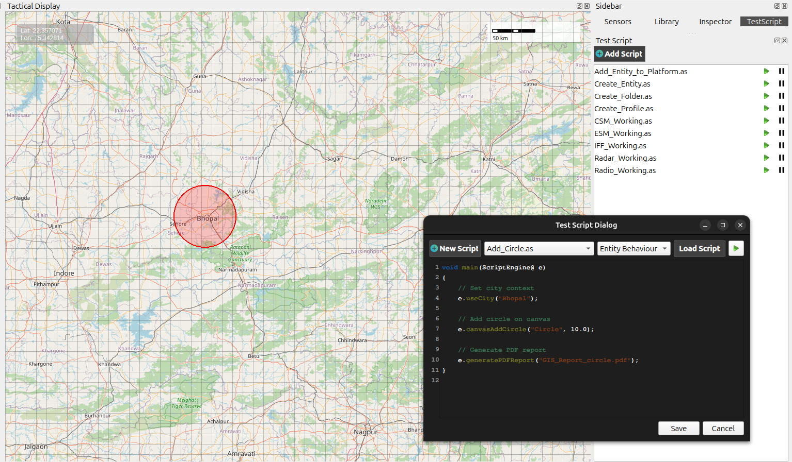
   
-----------------------------------------
Adding a Rectangle
-----------------------------------------

Rectangles are commonly used to represent restricted or operational zones.

**Syntax**

.. code-block:: cpp

   e.canvasAddRectangle(string name, float width, float height);

**Example**

.. code-block:: cpp

   void main(ScriptEngine@ e)
   {
       e.useCity("Bhopal");

       // Add rectangle on canvas
       e.canvasAddRectangle("Restricted_Zone", 20.0, 10.0);

       e.generatePDFReport("GIS_Report_rectangle.pdf");
   }

**Explanation**

- Draws a rectangle on the canvas.
- Width and height control the rectangle size.

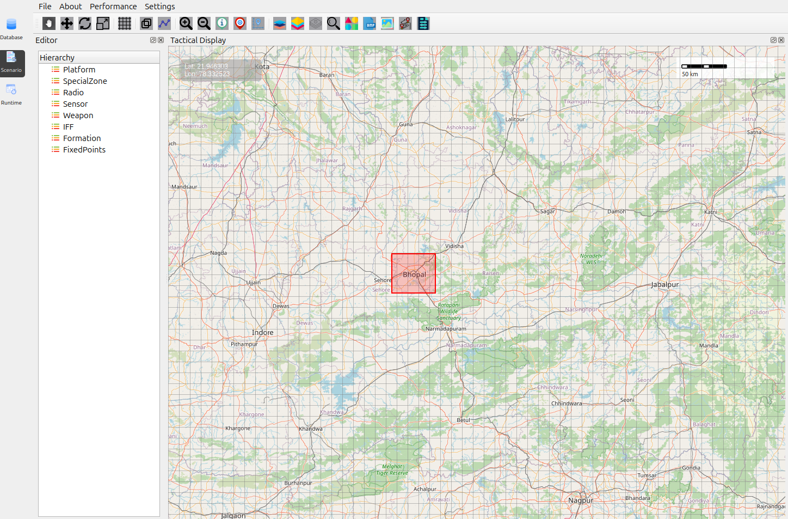

-----------------------------------------
Adding a Polygon
-----------------------------------------

Polygons allow drawing custom geographic regions using longitude and latitude.

**Syntax**

.. code-block:: cpp

   e.canvasAddPolygon(string name, array<string> points);

**Point Format**

Each point must be provided as:

::

   "Longitude, Latitude"

**Example: Polygon over India**

.. code-block:: cpp

   void main(ScriptEngine@ e)
   {
       Print("Plotting Polygon over India ##");

       array<string> indiaPoints = {
           "77.0, 30.0",   // North
           "78.11, 29.36", // East
           "77.23, 29.10", // South
           "76.64, 29.51", // West
           "77.0, 30.0"    // Closing point
       };

       e.canvasAddPolygon("India_Strategic_Zone", indiaPoints);

       e.generatePDFReport("GIS_Report_Polygon.pdf");
   }

**Explanation**

- Connects all points in sequence.
- The last point closes the polygon.
- Useful for borders, regions, and mission zones.

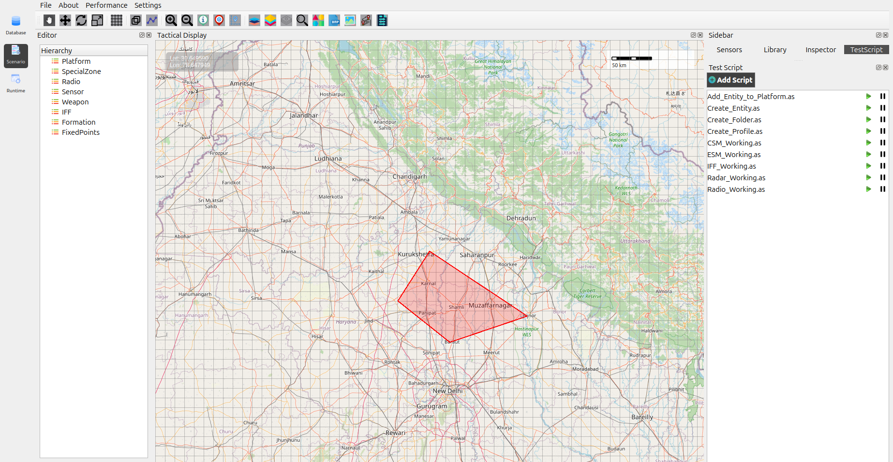
   
-----------------------------------------
Drawing a Line
-----------------------------------------

Lines can be used to represent paths, routes, or connections between locations.

**Syntax**

.. code-block:: cpp

   e.canvasStartLine();
   e.canvasAddLinePoint(double longitude, double latitude);
   e.canvasFinishLine();

**Example**

.. code-block:: cpp

   void main(ScriptEngine@ e)
   {

       // Start line drawing
       e.canvasStartLine();

       // Add line points
       e.canvasAddLinePoint(73.38, 28.08);
       e.canvasAddLinePoint(75.79, 26.99);

       // Finish line
       e.canvasFinishLine();

       // Generate PDF report
       e.generatePDFReport("line_pdf.pdf");
   }

**Explanation**

- ``canvasStartLine()`` – Begins the line drawing process.
- ``canvasAddLinePoint()`` – Adds a coordinate point to the line.
- ``canvasFinishLine()`` – Completes the line and renders it on the canvas.

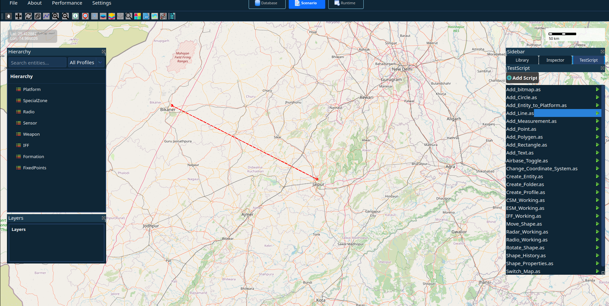
   
-----------------------------------------
Adding a Point
-----------------------------------------

Points are used to mark specific locations on the map such as landmarks,
assets, or important geographic positions.

**Syntax**

.. code-block:: cpp

   e.canvasAddPoint(string name, double longitude, double latitude);

**Example**

.. code-block:: cpp

   void main(ScriptEngine@ e)
   {

       // Plot a point on the canvas
       e.canvasAddPoint("Point", 78.34, 28.59);

       Print("Landmark Point marked.");

       // Wait for 2 seconds
       e.sleep(2000);

       // Generate PDF report
       e.generatePDFReport("Point_GIS_Report.pdf");
   }

**Explanation**

- ``canvasAddPoint()`` – Adds a point marker on the canvas.
- ``name`` – Identifier for the point.
- ``longitude, latitude`` – Geographic coordinates where the point will be placed.

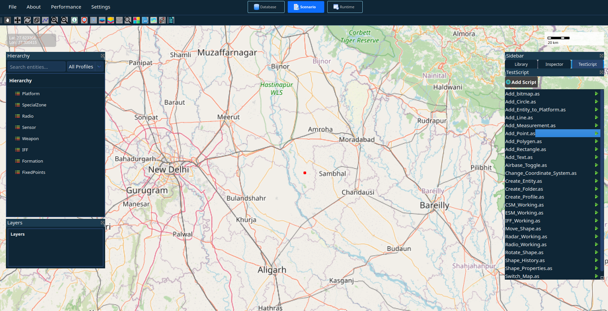
   
-----------------------------------------
Toggling Airbase Layer
-----------------------------------------

The airbase layer can be enabled to display airbase locations on the map.

**Syntax**

.. code-block:: cpp

   e.canvasToggleAirbases();

**Example**

.. code-block:: cpp

   void main(ScriptEngine@ e)
   {
       // Enable Airbase Layer
       e.canvasToggleAirbases();

       // Generate Auto Report
       e.generatePDFReport("Airbase_India_Report.pdf");
   }

**Explanation**

- ``canvasToggleAirbases()`` – Enables or disables the airbase layer on the canvas.
- Displays airbase locations available in the GIS dataset.

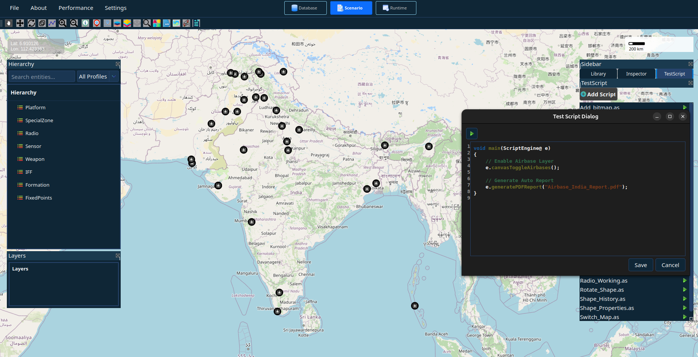
   
-----------------------------------------
Switching Map Type
-----------------------------------------

The canvas can switch between different map views.

**Syntax**

.. code-block:: cpp

   e.canvasSwitchMap(string mapType);

**Example: Terrain Map**

.. code-block:: cpp

   void main(ScriptEngine@ e)
   {
       // Switch to terrain view
       e.canvasSwitchMap("tarrine");

       e.generatePDFReport("tarrine_map.pdf");
   }

**Explanation**

- Changes the map to terrain/elevation view.
- Useful for topographical analysis.

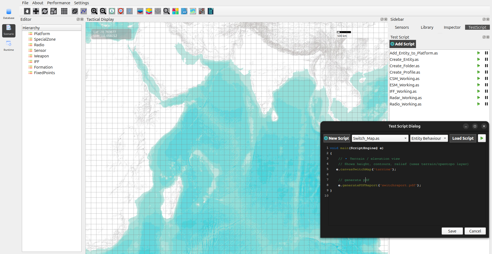

-----------------------------------------
Placing a Bitmap on the Canvas
-----------------------------------------

Bitmaps (icons or symbols) can be placed on the map using longitude and latitude.

**Syntax**

.. code-block:: cpp

   e.onBitmapSelected(string bitmapName, double longitude, double latitude);

**Example**

.. code-block:: cpp

   void main(ScriptEngine@ e)
   {
       // Bitmap location
       double lon = 78.02232;
       double lat = 27.14927;

       // Place bitmap on canvas
       e.onBitmapSelected("Hospital", lon, lat);

       // Generate PDF report
       e.generatePDFReport("bitmap_Report.pdf");
   }

**Explanation**

- Places a predefined bitmap icon on the map.
- Uses geographic coordinates(longitude, latitude)
- Useful for hospitals, trees, schools, or assets.

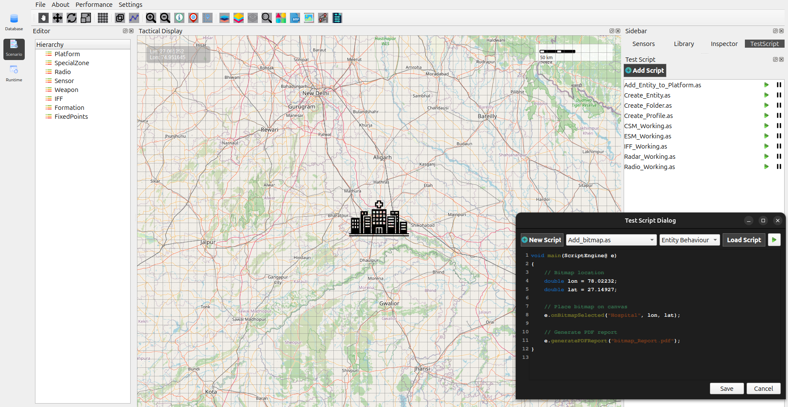

-----------------------------------------
UTM Coordinate System
-----------------------------------------

**Example**

.. code-block:: cpp

   void main(ScriptEngine@ e)
   {
       // Auto UTM (zone auto-detected from location)
       e.switchCoordinateSystem("utm");

       // Screenshot and PDF generated
       e.generatePDFReport("Map_Coordinate_System_Report_UTM.pdf");
   }

**Explanation**

- Automatically detects UTM zone
- Useful for Geo-detic and MGRS coordinate.

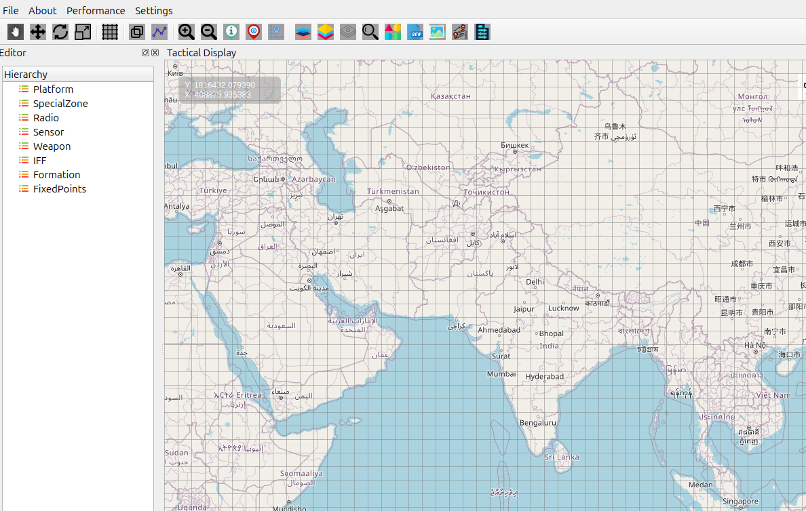

-----------------------------------------
Moving a Shape on the Canvas
-----------------------------------------

Shapes can be repositioned after creation.

**Syntax**

.. code-block:: cpp

   e.moveShape(string shapeId, double longitude, double latitude);

-----------------------------------------
Viewing Shape History
-----------------------------------------

The system maintains a movement history of shapes.

**Example**

.. code-block:: cpp

   void main(ScriptEngine@ e)
   {
       // City context
       e.useCity("Bhopal");

       // Add a circle
       e.canvasAddCircle("Circle", 10.0);

       // Move the newly created circle
       e.moveShape("TempCircle_0", 75.8481, 22.7375);

       e.sleep(3000);  // wait for 3 seconds

       // Show previous movement history
       e.showShapeHistory("TempCircle_0");

       // Generate PDF report
       e.generatePDFReport("GIS_Report_History_Shown.pdf");
   }

**Explanation**

- Tracks previous positions of a shape
- Useful for movement analysis and playback
- History is visible both on canvas and in reports

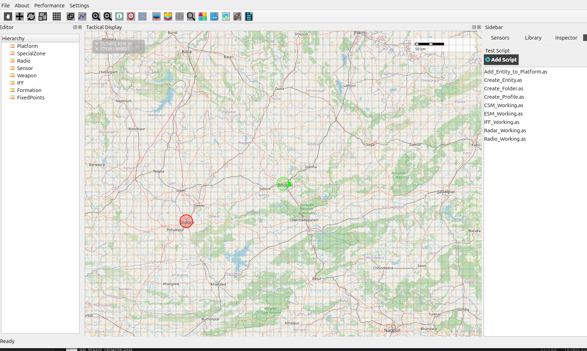
   
-----------------------------------------
Generating PDF Report
-----------------------------------------

Exports the current canvas view as a PDF file.

**Syntax**

.. code-block:: cpp

   e.generatePDFReport(string fileName);

**Example**

.. code-block:: cpp

   e.generatePDFReport("GIS_Final_Report.pdf");

**Explanation**

- Captures all visible GIS objects
- Useful for documentation and reporting

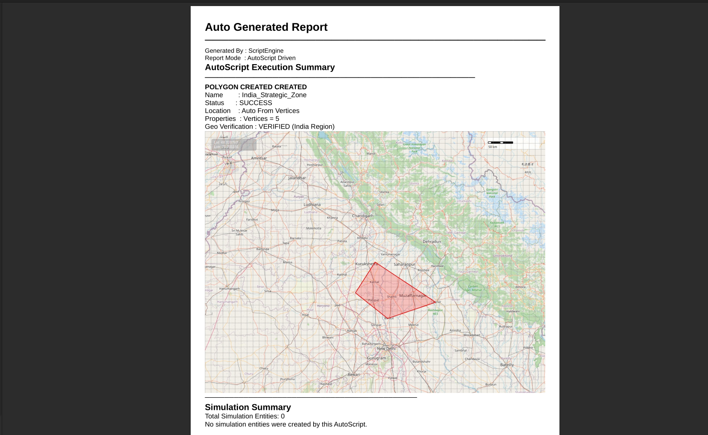
