Radar, CSM, ESM, Radio & IFF Simulation System
===============================================

This documentation explains how to simulate **air, radar, electronic warfare,
and communication systems** using ``ScriptEngine``.  
It covers **platform creation, sensors, detection logic, UI automation,
screenshots, and PDF report generation**.

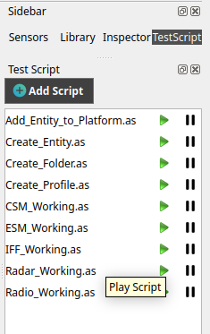
   
-----------------------------------
Radar Simulation & Detection System
-----------------------------------

Radar simulation allows moving aircraft to detect other targets in real time.

Creating a Profile Context
~~~~~~~~~~~~~~~~~~~~~~~~~~

Before adding platforms, a profile category must be created.

**Syntax**

.. code-block:: cpp

   ProfileCategaory@ e.NewProfile(string profileName);

**Example**

.. code-block:: cpp

   ProfileCategaory@ p = e.NewProfile("AircraftProfile");

**Explanation**

- Creates a logical container for platforms
- Used for grouping, filtering, and reporting

Adding a Platform (Aircraft / Jet)
~~~~~~~~~~~~~~~~~~~~~~~~~~~~~~~~~~

Platforms represent moving entities such as aircraft or UAVs.

**Syntax**

.. code-block:: cpp

   Platform@ e.addEntityToPlatform(ProfileCategaory@ profile, string platformName);

**Example**

.. code-block:: cpp

   Platform@ jet1 = e.addEntityToPlatform(p, "Jet1");

**Explanation**

- Adds a platform under a profile
- Platforms support movement, sensors, and trajectories

Setting Platform Speed
~~~~~~~~~~~~~~~~~~~~~

**Syntax**

.. code-block:: cpp

   platform.dynamicModel.moveSpeed = float speed;

**Example**

.. code-block:: cpp

   jet1.dynamicModel.moveSpeed = 1500;

**Explanation**

- Speed applies across all waypoints
- Higher values simulate fast aircraft

Setting Initial Geographic Position
~~~~~~~~~~~~~~~~~~~~~~~~~~~~~~~~~~~

**Syntax**

.. code-block:: cpp

   platform.transform.setGeoCord(float latitude, float longitude, float altitude);

**Example**

.. code-block:: cpp

   jet1.transform.setGeoCord(27.1767f, 78.0081f, 0.0f);

**Explanation**

- Uses latitude, longitude, and altitude (meters)
- Must be set before movement begins

Defining Platform Trajectory
~~~~~~~~~~~~~~~~~~~~~~~~~~~~~

**Syntax**

.. code-block:: cpp

   platform.trajectory.addWaypoint(float latitude, float altitude, float longitude);

**Example**

.. code-block:: cpp

   jet1.trajectory.addWaypoint(27.1767f, 0.0f, 78.0081f);
   jet1.trajectory.addWaypoint(28.6139f, 0.0f, 77.2090f);

**Explanation**

- Platform moves sequentially through waypoints
- Supports multi-leg routes

Adding a Radar Sensor
----------------------

**Syntax**

.. code-block:: cpp

   e.addSensorSubComponent(Platform@ platform, string sensorName, string sensorType);

**Example**

.. code-block:: cpp

   e.addSensorSubComponent(jet1, "Radar", "Generic");

**Explanation**

- Attaches a radar sensor
- Radar emits signals and detects targets

Accessing a Radar Sensor
~~~~~~~~~~~~~~~~~~~~~~~~

**Syntax**

.. code-block:: cpp

   Sensor@ platform.getSensorByName(string sensorName);

**Example**

.. code-block:: cpp

   Sensor@ jet1Radar = jet1.getSensorByName("Radar");

Automated UI Display Selection
~~~~~~~~~~~~~~~~~~~~~~~~~~~~~~

**Syntax**

.. code-block:: cpp

   e.selectEntityDisplay(Sensor@ sensor);

**Example**

.. code-block:: cpp

   e.selectEntityDisplay(jet1Radar);

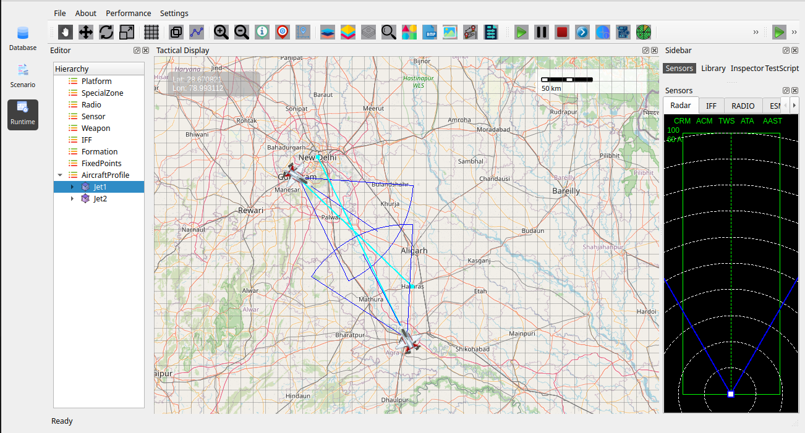
   

Radar Target Detection
~~~~~~~~~~~~~~~~~~~~~~

**Syntax**

.. code-block:: cpp

   int sensor.getTargetCount();
   Target sensor.getTarget(int index);

**Example**

.. code-block:: cpp

   int count = jet1Radar.getTargetCount();
   Target tgt = jet1Radar.getTarget(0);

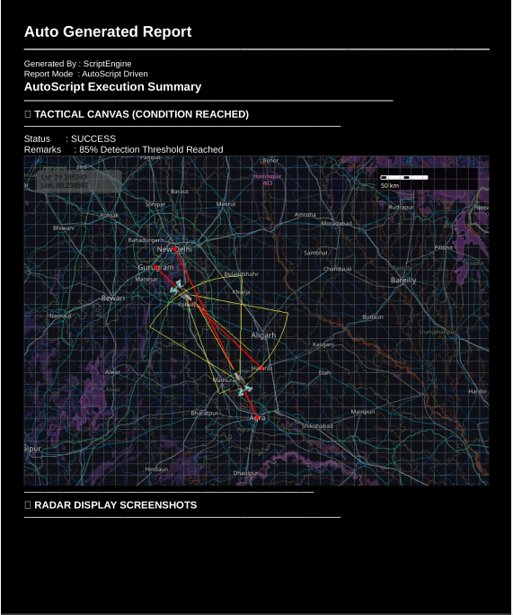
   

Capturing Radar Screenshots
~~~~~~~~~~~~~~~~~~~~~~~~~~~~

**Syntax**

.. code-block:: cpp

   e.captureSensorScreenshot(string fileName);

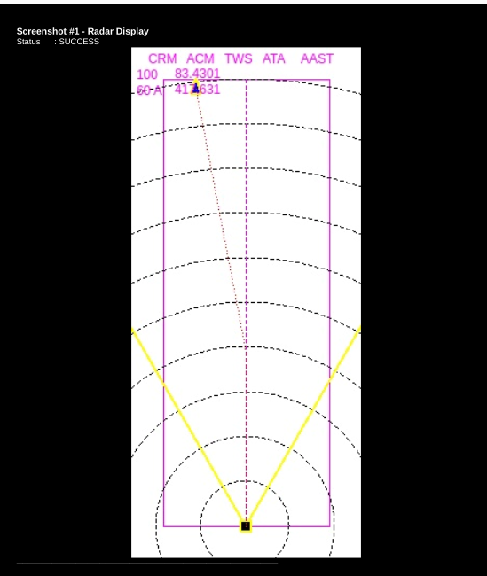
   
   
   .. image:: ../../images/Radar4.png
   :alt: Radar
   :align: center
   :width: 600
   

Complete Radar Example
~~~~~~~~~~~~~~~~~~~~~~~

.. code-block:: cpp

   void main(ScriptEngine@ e)
   {
       ProfileCategaory@ p = e.NewProfile("AircraftProfile");

       Platform@ jet1 = e.addEntityToPlatform(p, "Jet1");
       jet1.dynamicModel.moveSpeed = 1500;
       jet1.transform.setGeoCord(27.1767f, 78.0081f, 0.0f);

       jet1.trajectory.addWaypoint(27.1767f, 0.0f, 78.0081f);
       jet1.trajectory.addWaypoint(28.6139f, 0.0f, 77.2090f);

       e.addSensorSubComponent(jet1, "Radar", "Generic");

       Sensor@ radar = jet1.getSensorByName("Radar");
       e.selectEntityDisplay(radar);

       SimStart(e);

       for(int i = 0; i < 300; i++)
       {
           e.sleep(1000);
           if(radar.getTargetCount() > 0)
           {
               e.captureSensorScreenshot("detection.png");
               e.generatePDFReport("Radar_Report.pdf");
               break;
           }
       }

       SimPause(e);
   }

--------------------------------------
CSM – Communication Support Measures
--------------------------------------

CSM detects **radio frequency emissions** from transmitting platforms.

Adding a Radio Subcomponent
~~~~~~~~~~~~~~~~~~~~~~~~~~~

**Syntax**

.. code-block:: cpp

   e.addRadioSubComponent(Platform@ platform, string radioName);

Adding a CSM Sensor
~~~~~~~~~~~~~~~~~~~~

**Syntax**

.. code-block:: cpp

   e.addSensorSubComponent(Platform@ platform, string sensorName, string sensorType);

**Example**

.. code-block:: cpp

   e.addSensorSubComponent(jet2, "CSM1", "CSM");

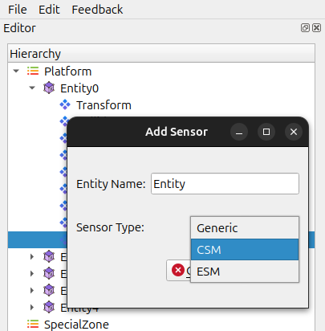
   
CSM Target Detection
~~~~~~~~~~~~~~~~~~~~

**Syntax**

.. code-block:: cpp

   int sensor.getCSMTargetCount();

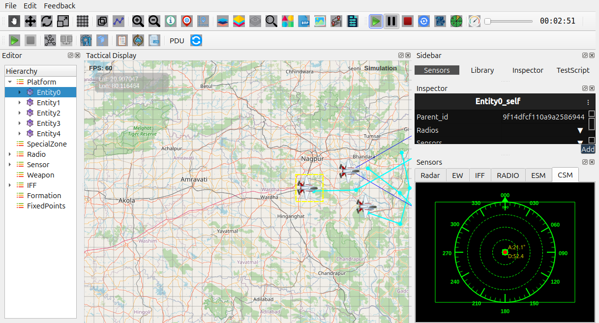
   
   .. image:: ../../images/CSM3.png
   :alt: CSM
   :align: center
   :width: 600

----------------------------------
ESM – Electronic Support Measures
----------------------------------

ESM sensors detect **radar emissions** without transmitting.

Adding an ESM Sensor
~~~~~~~~~~~~~~~~~~~~

**Syntax**

.. code-block:: cpp

   e.addSensorSubComponent(Platform@ platform, string sensorName, string sensorType);

**Example**

.. code-block:: cpp

   e.addSensorSubComponent(jet2, "ESM1", "ESM");

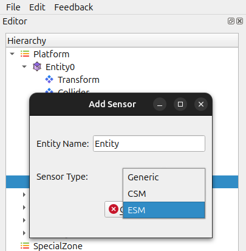
   

ESM Target Detection
~~~~~~~~~~~~~~~~~~~~

**Syntax**

.. code-block:: cpp

   int sensor.getESMTargetCount();
   
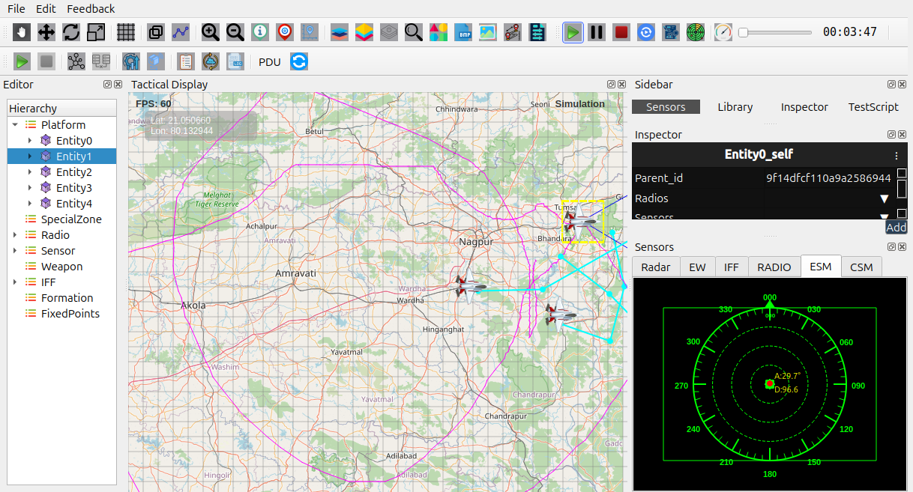
   
 .. image:: ../../images/ESM3.png
    :alt: ESM
    :align: center
    :width: 600

------------------------------
Radio Communication Detection
------------------------------

Radio systems detect communication signals between platforms.

Adding a Radio Component
~~~~~~~~~~~~~~~~~~~~~~~~~

**Syntax**

.. code-block:: cpp

   e.addRadioSubComponent(Platform@ platform, string radioName);

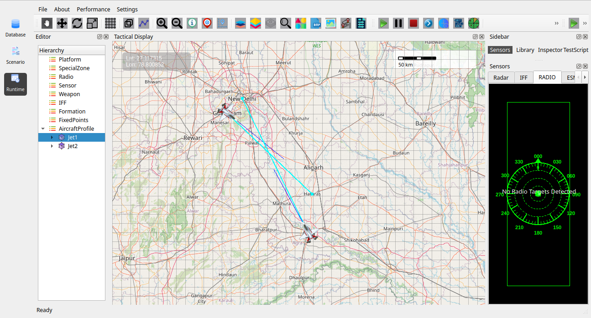
    

Radio Target Detection
~~~~~~~~~~~~~~~~~~~~~~~

**Syntax**

.. code-block:: cpp

   int radio.getRadioTargetCount();
   bool radio.getRadioTarget(int index,
                             string&out name,
                             float&out radius,
                             float&out angle,
                             float&out range,
                             float&out frequency);

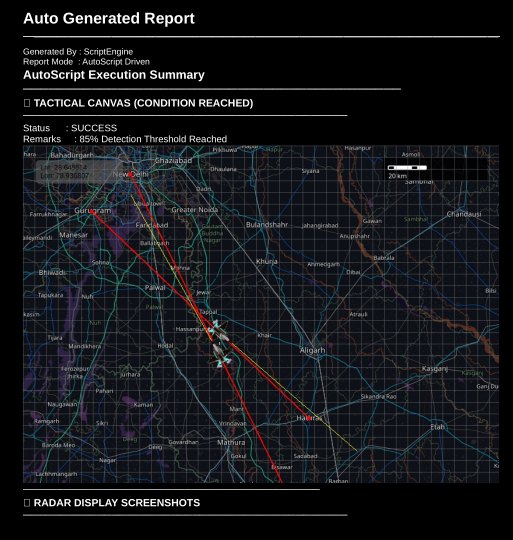
    
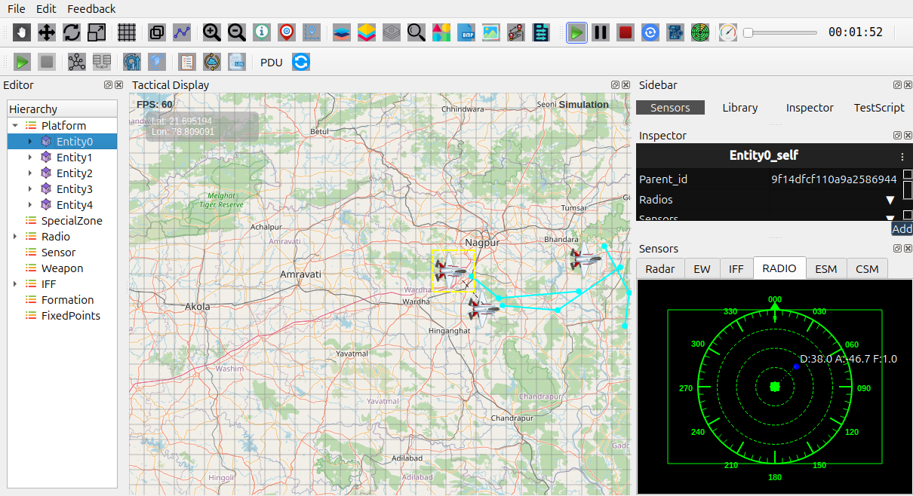
    
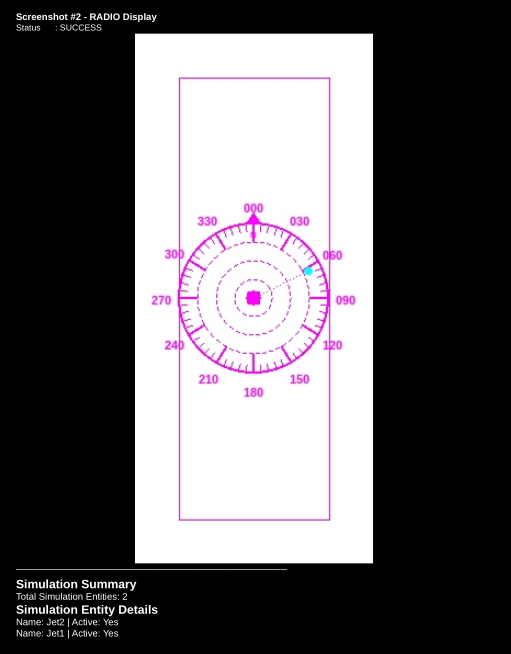
     
-----------------------------------
IFF – Identification Friend or Foe
-----------------------------------

IFF systems classify detected aircraft as **Friend or Foe**.

Adding an IFF Subcomponent
~~~~~~~~~~~~~~~~~~~~~~~~~~~

**Syntax**

.. code-block:: cpp

   e.addIFFSubComponent(Platform@ platform, string iffName);

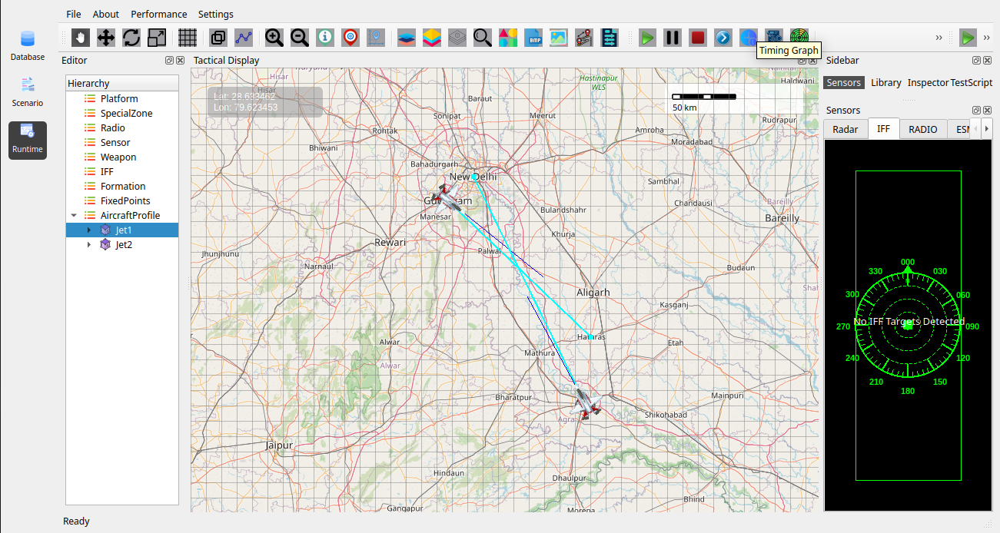
    
    
IFF Target Detection
~~~~~~~~~~~~~~~~~~~~~

**Syntax**

.. code-block:: cpp

   int iff.getIFFTargetCount();

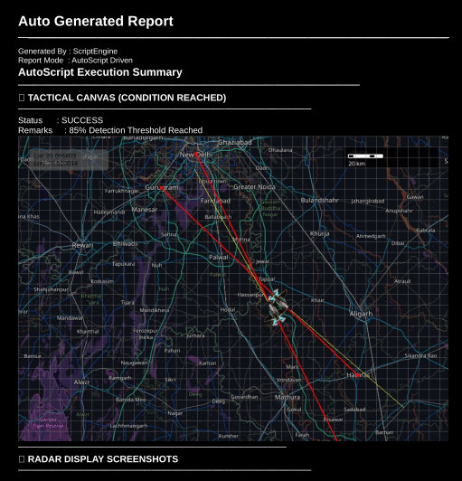
    
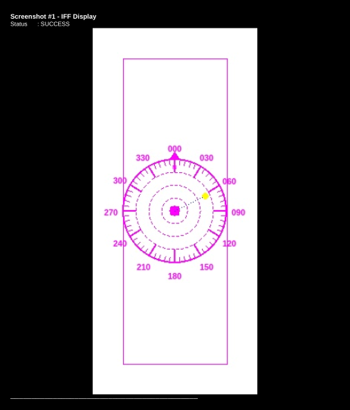
    
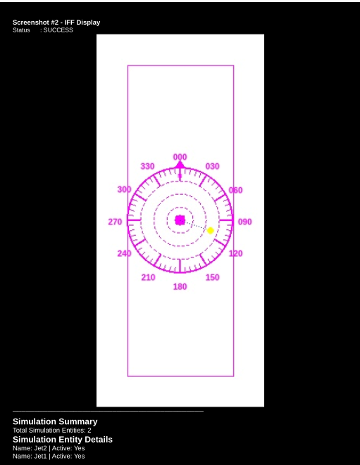
    
-------------------------------------------------
Operational Flow Summary
-------------------------------------------------

- Create profile
- Add platforms
- Attach sensors (Radar / CSM / ESM / Radio / IFF)
- Start simulation
- Monitor detections
- Capture screenshots
- Generate PDF report
- Stop simulation

This documentation explains how to simulate **air, radar, electronic warfare,
and communication systems** using ``ScriptEngine``.  
It covers **platform creation, sensors, detection logic, UI automation,
screenshots, and PDF report generation**.

------------------------------------
Radar Simulation & Detection System
------------------------------------

Radar simulation allows moving aircraft to detect other targets in real time.

-------------------------------------------------
Creating a Profile Context
-------------------------------------------------

Before adding platforms, a profile category must be created.

**Syntax**

.. code-block:: cpp

   ProfileCategaory@ e.NewProfile(string profileName);

**Example**

.. code-block:: cpp

   ProfileCategaory@ p = e.NewProfile("AircraftProfile");

**Explanation**

- Creates a logical container for platforms
- Used for grouping, filtering, and reporting

-------------------------------------------------
Adding a Platform (Aircraft / Jet)
-------------------------------------------------

Platforms represent moving entities such as aircraft or UAVs.

**Syntax**

.. code-block:: cpp

   Platform@ e.addEntityToPlatform(ProfileCategaory@ profile, string platformName);

**Example**

.. code-block:: cpp

   Platform@ jet1 = e.addEntityToPlatform(p, "Jet1");

**Explanation**

- Adds a platform under a profile
- Platforms support movement, sensors, and trajectories

Setting Platform Speed
~~~~~~~~~~~~~~~~~~~~~~

**Syntax**

.. code-block:: cpp

   platform.dynamicModel.moveSpeed = float speed;

**Example**

.. code-block:: cpp

   jet1.dynamicModel.moveSpeed = 1500;

**Explanation**

- Speed applies across all waypoints
- Higher values simulate fast aircraft

Setting Initial Geographic Position
~~~~~~~~~~~~~~~~~~~~~~~~~~~~~~~~~~~

**Syntax**

.. code-block:: cpp

   platform.transform.setGeoCord(float latitude, float longitude, float altitude);

**Example**

.. code-block:: cpp

   jet1.transform.setGeoCord(27.1767f, 78.0081f, 0.0f);

**Explanation**

- Uses latitude, longitude, and altitude (meters)
- Must be set before movement begins

Defining Platform Trajectory
~~~~~~~~~~~~~~~~~~~~~~~~~~~~

**Syntax**

.. code-block:: cpp

   platform.trajectory.addWaypoint(float latitude, float altitude, float longitude);

**Example**

.. code-block:: cpp

   jet1.trajectory.addWaypoint(27.1767f, 0.0f, 78.0081f);
   jet1.trajectory.addWaypoint(28.6139f, 0.0f, 77.2090f);

**Explanation**

- Platform moves sequentially through waypoints
- Supports multi-leg routes

-------------------------------------------------
Adding a Radar Sensor
-------------------------------------------------

**Syntax**

.. code-block:: cpp

   e.addSensorSubComponent(Platform@ platform, string sensorName, string sensorType);

**Example**

.. code-block:: cpp

   e.addSensorSubComponent(jet1, "Radar", "Generic");

**Explanation**

- Attaches a radar sensor
- Radar emits signals and detects targets

Accessing a Radar Sensor
~~~~~~~~~~~~~~~~~~~~~~~~

**Syntax**

.. code-block:: cpp

   Sensor@ platform.getSensorByName(string sensorName);

**Example**

.. code-block:: cpp

   Sensor@ jet1Radar = jet1.getSensorByName("Radar");

-------------------------------------------------
Automated UI Display Selection
-------------------------------------------------

**Syntax**

.. code-block:: cpp

   e.selectEntityDisplay(Sensor@ sensor);

**Example**

.. code-block:: cpp

   e.selectEntityDisplay(jet1Radar);

-------------------------------------------------
Radar Target Detection
-------------------------------------------------

**Syntax**

.. code-block:: cpp

   int sensor.getTargetCount();
   Target sensor.getTarget(int index);

**Example**

.. code-block:: cpp

   int count = jet1Radar.getTargetCount();
   Target tgt = jet1Radar.getTarget(0);

-------------------------------------------------
Capturing Radar Screenshots
-------------------------------------------------

**Syntax**

.. code-block:: cpp

   e.captureSensorScreenshot(string fileName);

Complete Radar Example
~~~~~~~~~~~~~~~~~~~~~~~

.. code-block:: cpp

   void main(ScriptEngine@ e)
   {
       ProfileCategaory@ p = e.NewProfile("AircraftProfile");

       Platform@ jet1 = e.addEntityToPlatform(p, "Jet1");
       jet1.dynamicModel.moveSpeed = 1500;
       jet1.transform.setGeoCord(27.1767f, 78.0081f, 0.0f);

       jet1.trajectory.addWaypoint(27.1767f, 0.0f, 78.0081f);
       jet1.trajectory.addWaypoint(28.6139f, 0.0f, 77.2090f);

       e.addSensorSubComponent(jet1, "Radar", "Generic");

       Sensor@ radar = jet1.getSensorByName("Radar");
       e.selectEntityDisplay(radar);

       SimStart(e);

       for(int i = 0; i < 300; i++)
       {
           e.sleep(1000);
           if(radar.getTargetCount() > 0)
           {
               e.captureSensorScreenshot("detection.png");
               e.generatePDFReport("Radar_Report.pdf");
               break;
           }
       }

       SimPause(e);
   }

-------------------------------------
CSM – Communication Support Measures
-------------------------------------

CSM detects **radio frequency emissions** from transmitting platforms.

~~~~~~~~~~~~~~~~~~~~~~~~~~~~~
Adding a Radio Subcomponent
~~~~~~~~~~~~~~~~~~~~~~~~~~~~~

**Syntax**

.. code-block:: cpp

   e.addRadioSubComponent(Platform@ platform, string radioName);

~~~~~~~~~~~~~~~~~~~~~~~~~
Adding a CSM Sensor
~~~~~~~~~~~~~~~~~~~~~~~~~

**Syntax**

.. code-block:: cpp

   e.addSensorSubComponent(Platform@ platform, string sensorName, string sensorType);

**Example**

.. code-block:: cpp

   e.addSensorSubComponent(jet2, "CSM1", "CSM");

~~~~~~~~~~~~~~~~~~~~~
CSM Target Detection
~~~~~~~~~~~~~~~~~~~~~

**Syntax**

.. code-block:: cpp

   int sensor.getCSMTargetCount();

----------------------------------
ESM – Electronic Support Measures
----------------------------------

ESM sensors detect **radar emissions** without transmitting.

~~~~~~~~~~~~~~~~~~~~~
Adding an ESM Sensor
~~~~~~~~~~~~~~~~~~~~~

**Syntax**

.. code-block:: cpp

   e.addSensorSubComponent(Platform@ platform, string sensorName, string sensorType);

**Example**

.. code-block:: cpp

   e.addSensorSubComponent(jet2, "ESM1", "ESM");

-------------------------------------------------
ESM Target Detection
-------------------------------------------------

**Syntax**

.. code-block:: cpp

   int sensor.getESMTargetCount();

------------------------------
Radio Communication Detection
------------------------------

Radio systems detect communication signals between platforms.

Adding a Radio Component
~~~~~~~~~~~~~~~~~~~~~~~~~

**Syntax**

.. code-block:: cpp

   e.addRadioSubComponent(Platform@ platform, string radioName);

Radio Target Detection
~~~~~~~~~~~~~~~~~~~~~~~

**Syntax**

.. code-block:: cpp

   int radio.getRadioTargetCount();
   bool radio.getRadioTarget(int index,
                             string&out name,
                             float&out radius,
                             float&out angle,
                             float&out range,
                             float&out frequency);

-----------------------------------
IFF – Identification Friend or Foe
----------------------------------

IFF systems classify detected aircraft as **Friend or Foe**.

Adding an IFF Subcomponent
~~~~~~~~~~~~~~~~~~~~~~~~~~

**Syntax**

.. code-block:: cpp

   e.addIFFSubComponent(Platform@ platform, string iffName);

IFF Target Detection
~~~~~~~~~~~~~~~~~~~~

**Syntax**

.. code-block:: cpp

   int iff.getIFFTargetCount();

-------------------------------------------------
Operational Flow Summary
-------------------------------------------------

- Create profile
- Add platforms
- Attach sensors (Radar / CSM / ESM / Radio / IFF)
- Start simulation
- Monitor detections
- Capture screenshots
- Generate PDF report
- Stop simulation

