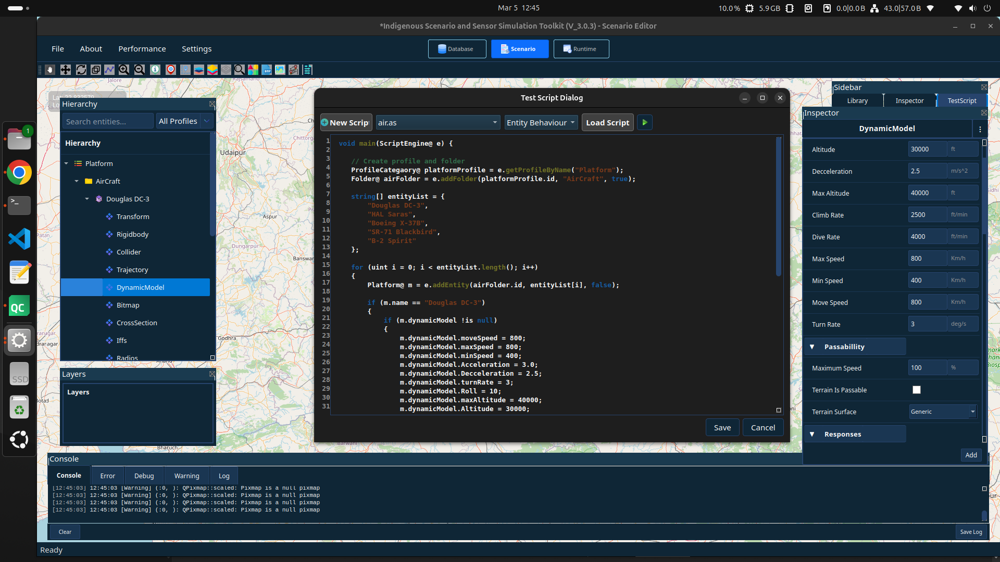
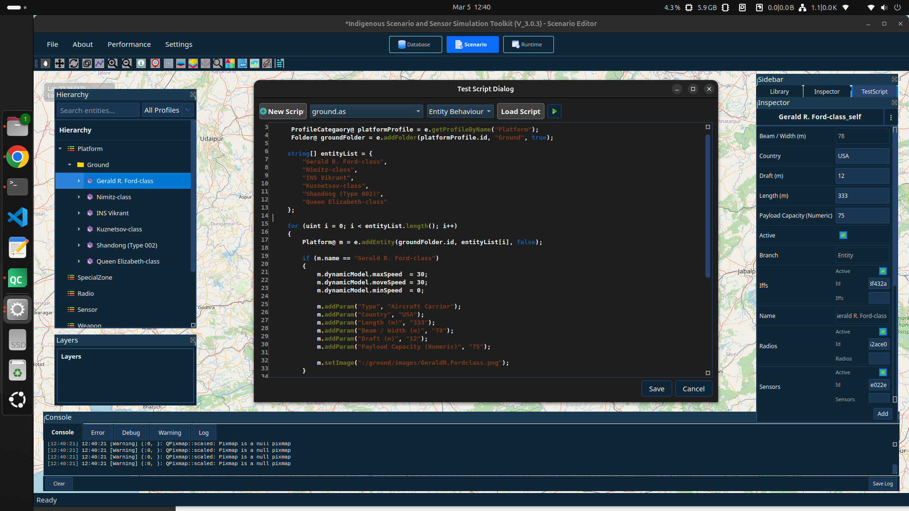
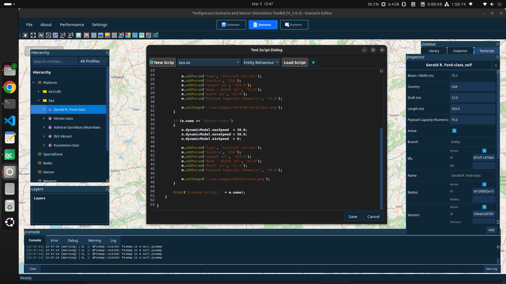

Database Scripting Guide
========================

This section explains how to use **database scripting** to create platform
hierarchies and automatically add entities with properties.

Using database scripts, users can quickly generate large platform structures
such as **Air, Ground and Sea platforms** without manually creating them
through the user interface.

------------------
Script Entry Point
-------------------

Every database script must define a ``main`` function.

.. code-block:: cpp

   void main(ScriptEngine@ e)
   {
       // Script logic here
   }

-----------------------------
Getting the Platform Profile
-----------------------------

Before creating any platform entities, the **Platform profile category**
must be retrieved.

**Syntax**

.. code-block:: cpp

   ProfileCategaory@ profile = e.getProfileByName("Platform");

**Explanation**

- Retrieves the **Platform category** from the database.
- All platform hierarchies are created under this profile.

----------------------------------------
Creating a Folder in Platform Hierarchy
----------------------------------------

Folders are used to organize entities inside the platform hierarchy
such as **Ground, Air, and Sea**.

**Syntax**

.. code-block:: cpp

       ProfileCategaory@ platformProfile = e.getProfileByName("Platform");

       Folder@ folder = e.addFolder(platformProfile.id, "FolderName", true);

**Explanation**

- ``platformProfile.id`` – ID of the Platform profile where the folder will be created  
- ``FolderName`` – Name of the folder (e.g., Ground, Air, Sea)  
- ``true`` – Creates the folder if it does not already exist

**Example**

.. code-block:: cpp

   void main(ScriptEngine@ e)
   {
       ProfileCategaory@ platformProfile = e.getProfileByName("Platform");

       Folder@ seaFolder = e.addFolder(platformProfile.id, "Sea", true);
   }
   
-----------------------------------------
Setting Dynamic Model Parameters
-----------------------------------------

Dynamic model parameters control how a platform moves in the simulation
such as speed, altitude, and turning behaviour.

**Syntax**

.. code-block:: cpp

   entity.dynamicModel.parameter = value;

**Explanation**

- ``entity`` – Platform object created using ``addEntity``  
- ``dynamicModel`` – Contains movement related properties of the platform  
- ``parameter`` – The specific property to modify (e.g., moveSpeed, maxSpeed)

**Example**

.. code-block:: cpp

   void main(ScriptEngine@ e)
   {
       ProfileCategaory@ platformProfile = e.getProfileByName("Platform");
       Folder@ airFolder = e.addFolder(platformProfile.id, "Air", true);

       Platform@ m = e.addEntity(airFolder.id, "Example Aircraft", false);

       if (m.dynamicModel !is null)
       {
           m.dynamicModel.moveSpeed = 800;
           m.dynamicModel.maxSpeed  = 900;
           m.dynamicModel.minSpeed  = 300;
       }
   }

-----------------------------------------
Adding Custom Parameters
-----------------------------------------

Custom parameters are used to store additional platform information such
as type, country, or physical specifications.

**Syntax**

.. code-block:: cpp

   entity.addParam("Parameter Name", "Value");

**Explanation**

- ``Parameter Name`` – Name of the property to be displayed  
- ``Value`` – The value assigned to that property

**Example**

.. code-block:: cpp

   void main(ScriptEngine@ e)
   {
       ProfileCategaory@ platformProfile = e.getProfileByName("Platform");
       Folder@ seaFolder = e.addFolder(platformProfile.id, "Sea", true);

       Platform@ m = e.addEntity(seaFolder.id, "Example Ship", false);

       m.addParam("Type", "Destroyer");
       m.addParam("Country", "India");
   }

-----------------------------------------
Assigning Image to an Entity
-----------------------------------------

An image can be assigned to represent the platform visually in the
hierarchy and canvas.

**Syntax**

.. code-block:: cpp

   entity.setImage("image_path");

**Explanation**

- ``entity`` – Platform object created using ``addEntity``  
- ``image_path`` – Resource path of the image file

**Example**

.. code-block:: cpp

   void main(ScriptEngine@ e)
   {
       ProfileCategaory@ platformProfile = e.getProfileByName("Platform");
       Folder@ groundFolder = e.addFolder(platformProfile.id, "Ground", true);

       Platform@ m = e.addEntity(groundFolder.id, "Example Vehicle", false);

       m.setImage(":/ground/images/example.png");
   }

=========================================================
Air Platform Database Script
=========================================================

This script creates an **AirCraft folder** and adds aircraft entities
with flight dynamic properties.

.. code-block:: cpp

   void main(ScriptEngine@ e) {

       ProfileCategaory@ platformProfile = e.getProfileByName("Platform");
       Folder@ airFolder = e.addFolder(platformProfile.id, "AirCraft", true);

       string[] entityList = {
           "Douglas DC-3",
           "HAL Saras",
           "Boeing X-37B",
           "SR-71 Blackbird",
           "B-2 Spirit"
       };

       for (uint i = 0; i < entityList.length(); i++)
       {
           Platform@ m = e.addEntity(airFolder.id, entityList[i], false);

           if (m.name == "Douglas DC-3")
           {
               if (m.dynamicModel !is null)
               {
                   m.dynamicModel.moveSpeed = 800;
                   m.dynamicModel.maxSpeed = 800;
                   m.dynamicModel.minSpeed = 400;
                   m.dynamicModel.Acceleration = 3.0;
                   m.dynamicModel.Decceleration = 2.5;
                   m.dynamicModel.turnRate = 3;
                   m.dynamicModel.Roll = 10;
                   m.dynamicModel.maxAltitude = 40000;
                   m.dynamicModel.Altitude = 30000;
                   m.dynamicModel.climbRate = 2500;
                   m.dynamicModel.diveRate = 4000;
               }

               m.setImage(":/air/images/air/DouglasDC3.png");
           }

           if (m.name == "HAL Saras")
           {
               if (m.dynamicModel !is null)
               {
                   m.dynamicModel.moveSpeed = 800;
                   m.dynamicModel.maxSpeed = 800;
                   m.dynamicModel.minSpeed = 400;
                   m.dynamicModel.Acceleration = 3.0;
                   m.dynamicModel.Decceleration = 2.5;
                   m.dynamicModel.turnRate = 3;
                   m.dynamicModel.Roll = 10;
                   m.dynamicModel.maxAltitude = 40000;
                   m.dynamicModel.Altitude = 30000;
                   m.dynamicModel.climbRate = 2500;
                   m.dynamicModel.diveRate = 4000;
               }

               m.setImage(":/air/images/air/HALSaras.png");
           }

           Print("Created Entity: " + m.name);
       }

   }
   

=========================================================
Ground Platform Database Script
=========================================================

This script creates a **Ground platform folder** and adds
multiple platform entities with parameters.

.. code-block:: cpp

   void main(ScriptEngine@ e) {

        ProfileCategaory@ platformProfile = e.getProfileByName("Platform");
        Folder@ groundFolder = e.addFolder(platformProfile.id, "Ground", true);

       string[] entityList = {
           "Gerald R. Ford-class",
           "Nimitz-class",
           "INS Vikrant",
           "Kuznetsov-class",
           "Shandong (Type 002)",
           "Queen Elizabeth-class"
       };

       for (uint i = 0; i < entityList.length(); i++)
       {
           Platform@ m = e.addEntity(groundFolder.id, entityList[i], false);

           if (m.name == "Gerald R. Ford-class")
           {
               m.dynamicModel.maxSpeed  = 30;
               m.dynamicModel.moveSpeed = 30;
               m.dynamicModel.minSpeed  = 0;

               m.addParam("Type", "Aircraft Carrier");
               m.addParam("Country", "USA");
               m.addParam("Length (m)", "333");
               m.addParam("Beam / Width (m)", "78");
               m.addParam("Draft (m)", "12");
               m.addParam("Payload Capacity (Numeric)", "75");

               m.setImage(":/ground/images/GeraldR.Fordclass.png");
           }

           if (m.name == "Nimitz-class")
           {
               m.dynamicModel.maxSpeed  = 30;
               m.dynamicModel.moveSpeed = 30;
               m.dynamicModel.minSpeed  = 0;

               m.addParam("Type", "Aircraft Carrier");
               m.addParam("Country", "USA");
               m.addParam("Length (m)", "333");
               m.addParam("Beam / Width (m)", "41");
               m.addParam("Draft (m)", "11.9");
               m.addParam("Payload Capacity (Numeric)", "64");

               m.setImage(":/ground/images/Nimitzclass.png");
           }

       }

   }
   

=========================================================
Sea Platform Database Script
=========================================================

This script creates a Sea platform folder and adds maritime entities including ships, submarines, and aircraft carriers.

.. code-block:: cpp

   void main(ScriptEngine@ e) {

        ProfileCategaory@ platformProfile = e.getProfileByName("Platform");
        Folder@ seaFolder = e.addFolder(platformProfile.id, "Sea", true);

       string[] entityList = {
           "Gerald R. Ford-class",
           "Nimitz-class",
           "Admiral Gorshkov (Mod Kiev)",
           "INS Vikrant",
           "Kuznetsov-class"
       };

       for (uint i = 0; i < entityList.length(); i++)
       {
           Platform@ m = e.addEntity(seaFolder.id, entityList[i], false);

           if (m.name == "Gerald R. Ford-class")
           {
               m.dynamicModel.maxSpeed  = 30.0;
               m.dynamicModel.moveSpeed = 30.0;
               m.dynamicModel.minSpeed  = 0;

               m.addParam("Type", "Aircraft Carrier");
               m.addParam("Country", "USA");
               m.addParam("Length (m)", "333.0");
               m.addParam("Beam / Width (m)", "78.0");
               m.addParam("Draft (m)", "12.0");
               m.addParam("Payload Capacity (Numeric)", "75.0");

               m.setImage(":/sea/images/GeraldR.Fordclass.png");
           }

           if (m.name == "Nimitz-class")
           {
               m.dynamicModel.maxSpeed  = 30.0;
               m.dynamicModel.moveSpeed = 30.0;
               m.dynamicModel.minSpeed  = 0;

               m.addParam("Type", "Aircraft Carrier");
               m.addParam("Country", "USA");
               m.addParam("Length (m)", "333.0");
               m.addParam("Beam / Width (m)", "41.0");
               m.addParam("Draft (m)", "11.9");
               m.addParam("Payload Capacity (Numeric)", "64.0");

               m.setImage(":/sea/images/Nimitzclass.png");
           }

           Print("Created Entity: " + m.name);
       }

   }
   

--------
Result
--------

After executing these scripts:

- Three platform folders are created:

  - **AirCraft**
  - **Ground**
  - **Sea**

- Multiple entities are automatically added to each hierarchy.
- Each entity contains:

  - Dynamic model parameters
  - Platform specifications
  - entities icons

These entities will appear in the **Hierarchy panel** and their properties
can be viewed in the **Inspector panel**.
