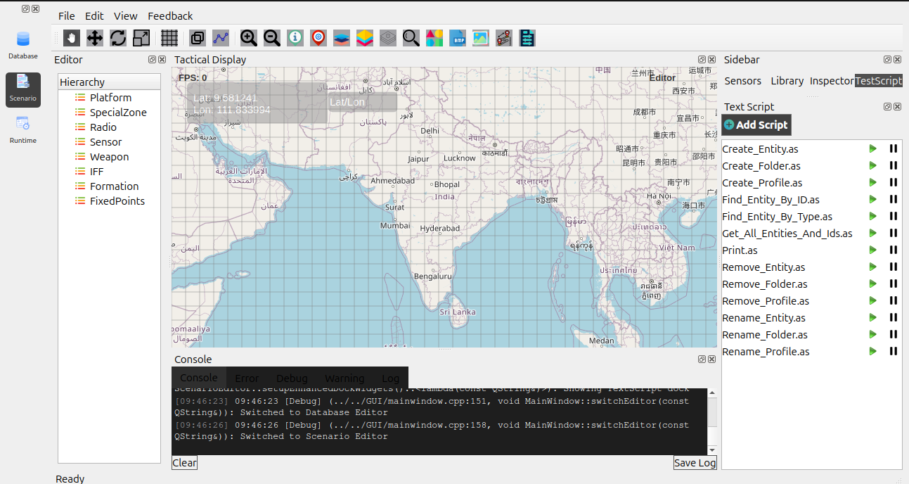
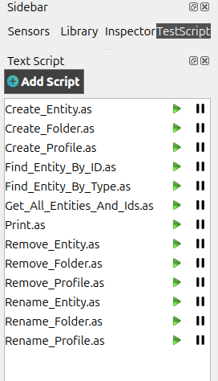
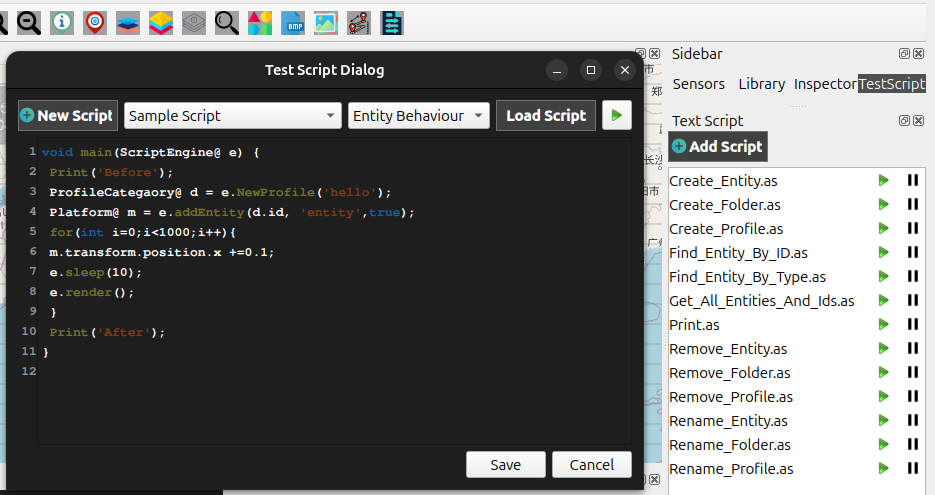
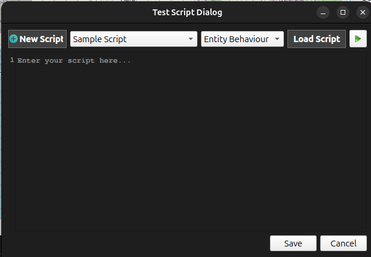
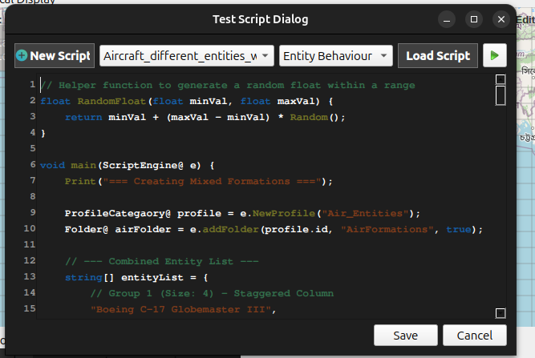

Adding and Running Scripts in Scenario Editor
=============================================

This section explains how to add, load, edit, save, and run scripts inside the Scenario Editor.
Scripts allow you to automate behaviors, test entity logic, and control scenario operations dynamically.

.. contents::
   :local:
   :depth: 1

Introduction to Scripts
-----------------------
Scripts in the Scenario Editor are used to:

- Control entity behaviors
- Automate scenario actions
- Test different simulation functions
- Load and run predefined logic
- Switch or modify entity states during a scenario

You can write a new script manually, load existing script files, or execute default sample scripts.

Switch to the Scenario Editor
-----------------------------
Before working with scripts, switch from the **Database Editor** to the **Scenario Editor** and
Click **Scenario** to enter the Scenario Editor and click **Test Script** from the sidebar to open the Text Script.

   
   
Select a Script (testScript)
----------------------------
On the left panel, locate **testScript** and click it to open its details.

   

Open the Script Panel
---------------------
On the right-side panel, locate the **Test Script** section and and open a testScript Dialog box.
This panel allows adding, editing, loading, running, and saving scripts.

Adding a New Script
-------------------
To create a completely new script:

1. Click **New Script** in the Script Panel.
2. A script editor window will appear where you can type your script.

Default Scripts
---------------
Some default scripts may be available for quick usage, such as:

- Sample script
- Create Entity
- Create Folder etc...

These can be loaded, edited, and executed directly.

Switch Entity Behavior Using Scripts
------------------------------------
Scripts can also be used to change entity behaviors dynamically.  
Examples include:

- Switching from idle to patrol  
- Changing movement paths  
- Updating sensor modes  
- Triggering specific actions  

You can write such logic inside the script editor and run it immediately.

Running the Script
------------------
After writing or loading a script, click on button to **Run** and execute it.

   

Loading an Existing Script
--------------------------
If you already have a saved script:

1. Click **Load Script**.
2. Select the script file from your system.
3. The script will open inside the editor.

Saving a Script
---------------
After modifying or creating a script:

1. Click **Save Script**.
2. Enter a file name.
3. The script will be saved for future use.

This allows you to reuse scripts across different entities or scenarios.

