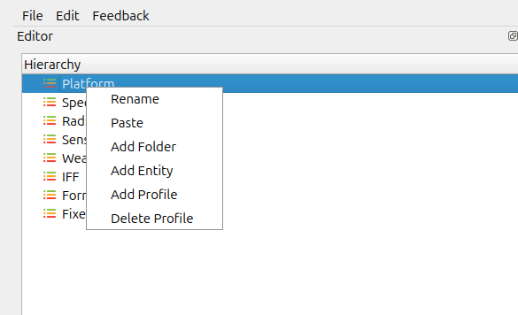
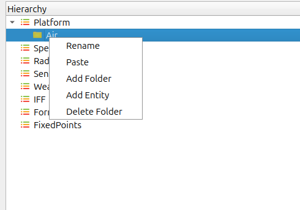
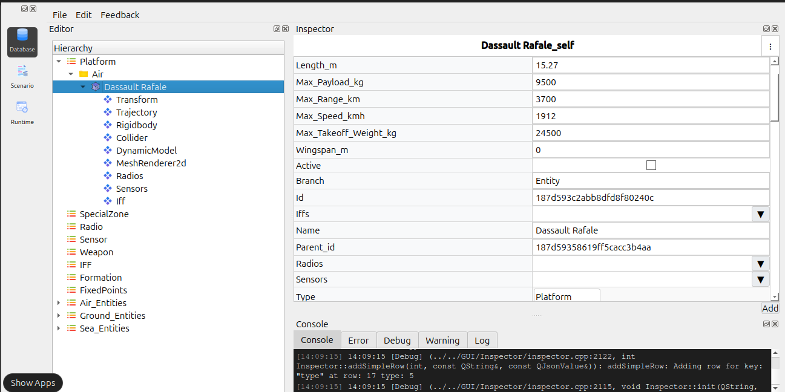
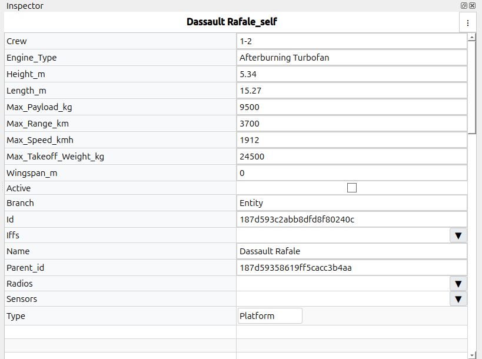

Adding a new platform profile
=============================

*To add a new platform profile*

To create new folders or entities inside the Database Editor, right-click options 
are available within the **Hierarchy Panel**.  
The steps below describe the complete workflow.

1. Creating a New Folder
------------------------

i. In the **Hierarchy Panel**, right-click on any existing profile or category.  
ii. A context menu appears with the following options:

   - **Add Folder**
   - **Add Entity**
   - **Add Profile**
   - **Paste**
   - **Rename**
   - **Delete Profile**

iii. Select **Add Folder**.  
iv. A dialog box opens asking for the folder name.  
v. Enter the desired folder name and click **OK**.  
vi. The newly created folder appears under the selected hierarchy.

   
*Set the Dynamic properties* 

Update the Dynamic model properties.

 - Move Speed: 1912 km/h
 - Turn Radius: 3215 m/s
 

     

