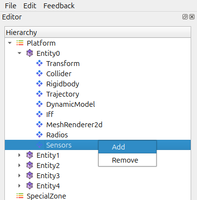

CSM (Command / Control / Combat System Manager)
===============================================

The CSM manages core system behaviour for an entity, including coordination between subsystems such as sensors, and radios. It acts as the central controller that drives AI behaviour and combat decisions.

.. contents::
   :local:
   :depth: 1

Purpose of CSM
--------------

The CSM helps you:

- Manage the operational state of an entity.
- Control the engagement workflow (detect → track → engage).
- Coordinate sensors, radios, and other connected systems.
- Provide a unified pipeline for AI and automated decision making.

Adding a CSM to an Entity
-------------------------

1. Select the entity in the **Hierarchy**.

.. image:: ../../images/iff1.png
   :alt: Radios Component
   :align: center
   :width: 500
   
   
2. Open the entity’s context menu.

   
   
3. Choose **Add Sensor** then Choose **CSM** from Dropdown.

.. image:: ../../images/CSM1.png
   :alt: Radios Component
   :align: center
   :width: 500
   
   
4. The CSM appears in the entity’s component list.

CSM Configuration
~~~~~~~~~~~~~~~~~

Once the CSM is added, you can configure:

- Range of Detection
- Linked sensors and weapon systems

How the CSM Works
~~~~~~~~~~~~~~~~~

- Continuously monitors incoming sensor data.
- Evaluates potential targets using rules from profiles or settings.

.. image:: ../../images/CSM2.png
   :alt: Radios Component
   :align: center
   :width: 500
   
Notes
~~~~~

- CSM effectiveness depends heavily on sensor accuracy and correct Radio setup.

