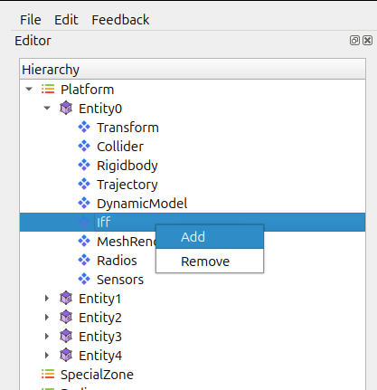
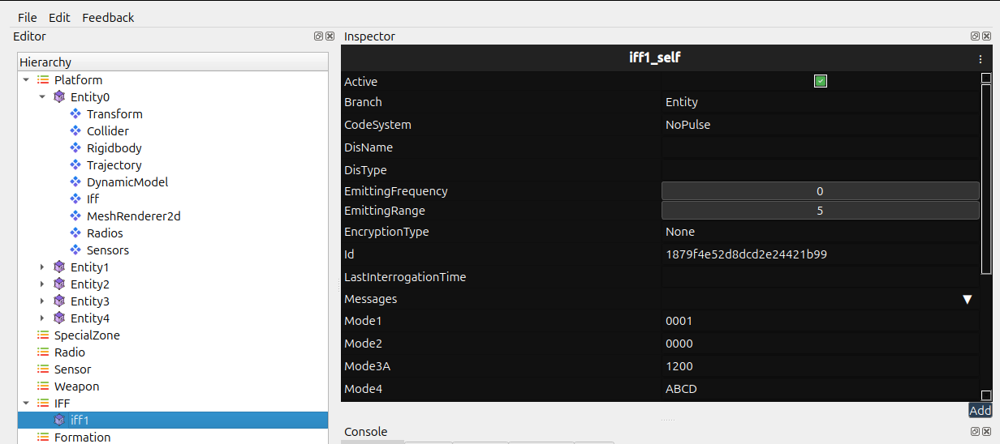
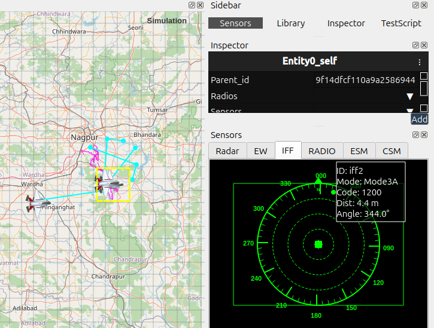

IFF 
===

The IFF system provides a clear visual indicator of an entity’s identification
status during a simulation. It helps you quickly confirm whether an entity is
marked as *Friendly*, or *Unknown*, based on the IFF profile assigned to it. This is useful for situational awareness and for checking that profiles and hierarchy setups are correct.

.. contents::
   :local:
   :depth: 1

Purpose of IFF
--------------

The IFF system helps you:

- Distinguish entities visually in real time.
- Confirm that each entity has the correct profile.
- Verify that sensors, radars, and AI systems are referencing the right IFF
  status.

Creating an IFF
---------------

1. Select an entity from the **Hierarchy**.

.. image:: ../../images/iff1.png
   :alt: Radios Component
   :align: center
   :width: 500
   
2. Open the context menu or toolbar options.

   
   
3. Choose **Add IFF**.

   
   
4. Adjust the Mode configuration, Range and other fields in Inspector Tab.

How the Display Behaves
~~~~~~~~~~~~~~~~~~~~~~~

- Updates in real time when an entity’s status changes.
- Uses color-coded indicators (default: green = friendly, red = hostile).
- Hovering over the display may show details such as entity ID, name, and IFF
  profile.
- Refreshes automatically during the simulation.

   

Recommended Usage
~~~~~~~~~~~~~~~~~

- Assign IFF profiles before you start the simulation.
- Use the display to double-check hierarchy relationships.
- Enable the display while debugging sensors, targeting systems, or engagement
  logic.

Common Issues and Fixes
~~~~~~~~~~~~~~~~~~~~~~~

**Display not visible**

- Make sure the widget was created for that entity.
- Check whether the IFF Display module is enabled in the settings.

**Color not updating**

- Restart or refresh the simulation after editing profile types.

Notes
~~~~~

- The IFF Display is purely visual; it does not affect simulation behaviour.
- It works for dynamically spawned entities as long as they receive a valid
  profile.

