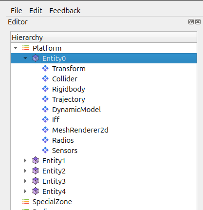
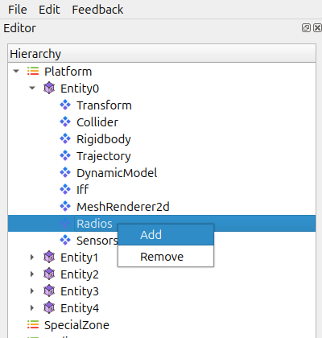
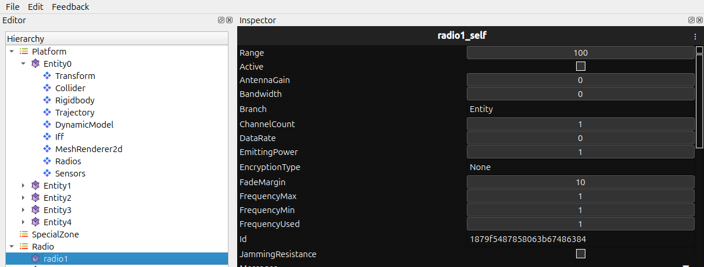

Radio System
============

The Radio System lets entities communicate using predefined radio profiles.
It manages channel assignments, transmission behaviour, and the connection
between radios and entities in the hierarchy.

.. contents::
   :local:
   :depth: 1

Purpose of Radio
----------------

The Radio System helps you:

- Enable communication between entities.
- Assign and manage radio channels or frequencies.
- Support simulation features that rely on radio messaging.
- Confirm that radios are attached and configured correctly during debugging.

Attaching a Radio to an Entity
------------------------------

1. Select the entity in the **Hierarchy**.

   
   
2. Open the context menu or the toolbar.

   
3. Choose **Add Radio**.

   
   
4. A new radio instance is created and linked to that entity.

How the Radio System Works
~~~~~~~~~~~~~~~~~~~~~~~~~~

- Radios activate automatically once attached.
- Transmission and reception depend on:
  
  - The assigned Radio Profile using Inspector Tab 
  - Frequency Matching Rules 
  - Any signal or scanning logic in the simulation  

.. image:: ../../images/Radio3.png
   :alt: Radios Component
   :align: center
   :width: 500
   
   
Recommended Usage
~~~~~~~~~~~~~~~~~

- Assign radio profiles before starting the simulation to avoid
  “unconfigured radio” states.
- Use clear, consistent names for channels and call signs when multiple radios
  are involved.
- Attach radios to parent entities first if the hierarchy is still being set up.

Common Issues and Fixes
~~~~~~~~~~~~~~~~~~~~~~~

**Radio not attaching**

- Make sure the entity exists in the Hierarchy.

**Entity unable to transmit**

- The radio may not be linked correctly in the hierarchy.
- Channel or frequency settings might be invalid.
- Transmission permissions may be disabled in the profile.

Notes
~~~~~

- Attaching a radio does not influence other entity systems unless they are
  explicitly connected.
- Dynamically spawned entities receive radios only if configured to do so.
- Radio channels do not enforce distance or signal range unless the simulation
  implements those features.

