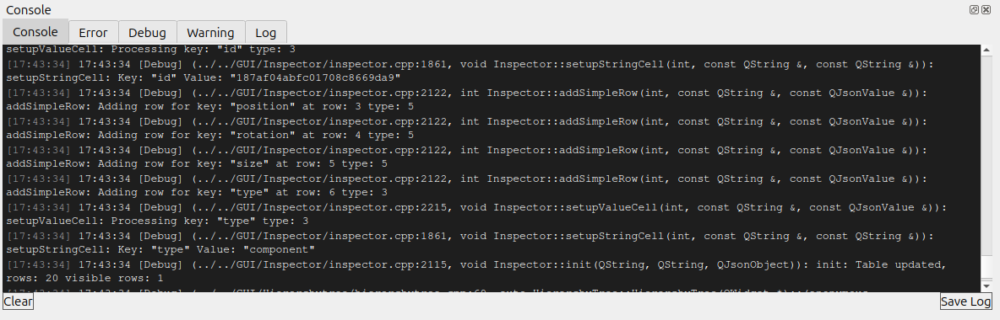

Console
=======

    
The console in this editor is divided into four standard categories: 

Log shows normal informational messages that confirm everything is working as expected — for example, files loaded, icons loaded, scripts initialized. These are routine status updates and indicate healthy operation. 

Debug contains messages intentionally written by developers for testing and troubleshooting during development. They are usually temporary and not meaningful to end users. 

Warning displays non-critical issues that do not stop the program but signal something that should ideally be corrected (e.g., deprecated functions, suboptimal settings, or recoverable problems). 

Error shows critical problems that can prevent the application from functioning correctly or may cause crashes (e.g., missing files, script compilation failures, null references, or runtime exceptions). 

 

