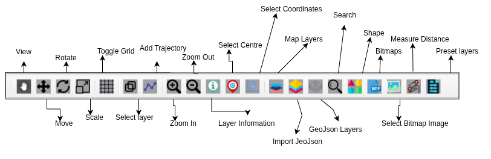

Design Toolbar
==========

**View** - This is the main screen where you see the map data.

**Move** - Drag to slide the map in any direction.

**Rotate** - Turn the map to a different orientation.

**Scale** - Increase or decrease the size of an object or layer.

**Toggle Grid** - Switch the background grid lines on or off.

**Select Layer** - Choose a specific layer from the list to edit.

**Add Trajectory** - Draw a path or line to show a route or movement.

**Zoom In** - Get a closer, more detailed view of a smaller area.

**Zoom Out** - See a larger area with less detail.

**Layer Information** - View the details and properties of the selected layer.

**Select Centre** - Set a new point to be the center of the map screen.

**Coordinates System** - The system that defines locations on the map.

**Map Layer** - A set of data that can be shown or hidden on the map.

**Import GeoJson** - Add a GeoJSON file from your computer to the map.

**GeoJson Layer** - A layer created from imported GeoJSON data.

**Search** - Type a name to find a location and jump directly to it.

**Shape** - Draw your own geometric shapes.

**Bitmaps** - Work with picture files on the map.

**Select Bitmap Image** - Choose an image from your computer to place on the map.

**Measure Distance** - Calculate the real-world distance between points.

**Preset Layer** - You are selecting from ready-made data sets that are already configured for the map.

