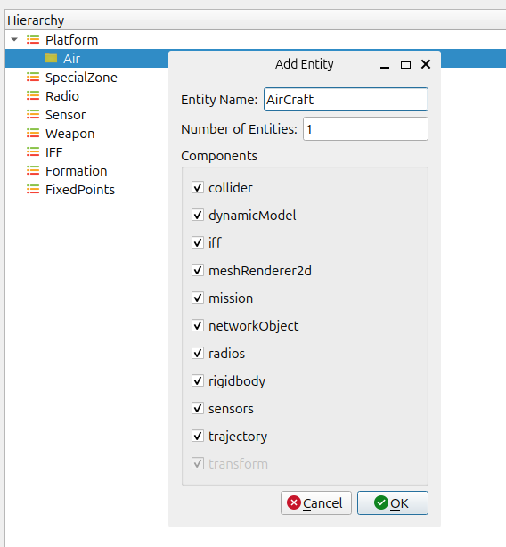
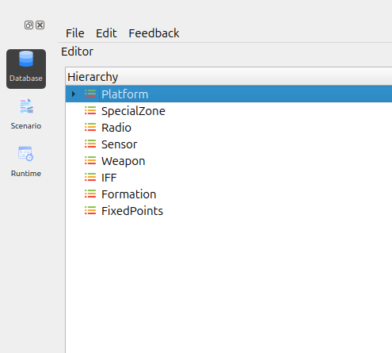
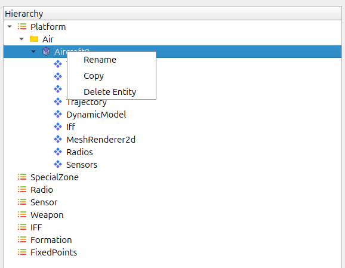
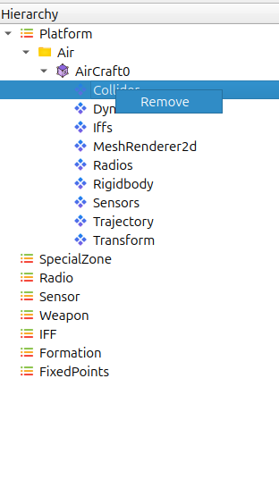

Creating Folders and Entities in the Database Editor
====================================================
To create new folders or entities inside the Database Editor, right-click options 
are available within the **Hierarchy Panel**.  
The steps below describe the complete workflow.

.. raw:: html

   

.. image:: ../../images/db_editor_overview.png
   :alt: Database Editor Overview
   :align: center
   :width: 600

.. raw:: html

   

1. Creating a New Folder
------------------------

.. raw:: html

   

.. image:: ../../images/db_create_folder.png
   :alt: Create Folder Option
   :align: center
   :width: 500

.. raw:: html

   

i. In the **Hierarchy Panel**, right-click on any existing profile or category.  
ii. A context menu appears with the following options:

   - **Add Folder**
   - **Add Entity**
   - **Add Profile**
   - **Paste**
   - **Rename**
   - **Delete Profile**

iii. Select **Add Folder**.  
iv. A dialog box opens asking for the folder name.  
v. Enter the desired folder name and click **OK**.  
vi. The newly created folder appears under the selected hierarchy.

2. Creating a New Entity
------------------------

.. raw:: html

   

.. raw:: html

   

i. Right-click on a folder inside the **Hierarchy Panel**.  
ii. A menu appears with options such as:

   - **Add Folder**
   - **Add Entity**
   - **Paste**
   - **Rename**
   - **Delete Folder**

iii. Click **Add Entity**.  
iv. The **Add Entity** dialog box opens.

This dialog contains:

   - **Entity Name** field  
   - **Number of Entities**  
   - **Component List** (collider, dynamicModel, iff, sensors, radios, trajectory, etc.)

v. Enter the entity name, choose the number of entities, and select required components.
vi. Click **OK** to create the entity.  
vii. The new entity is added under the selected folder.

.. raw:: html

   

.. raw:: html

   

.. raw:: html

   

.. raw:: html

   

.. raw:: html

   

.. raw:: html

   

