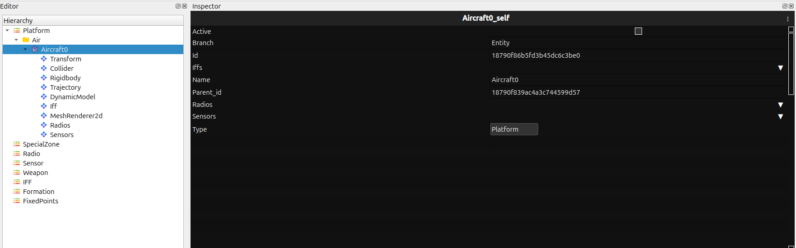
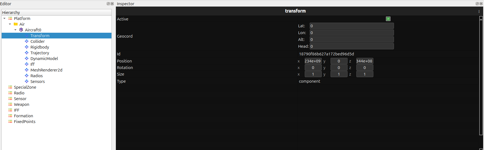
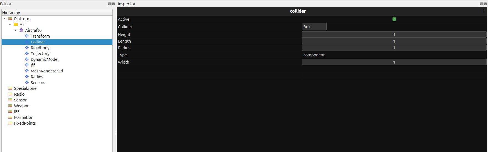
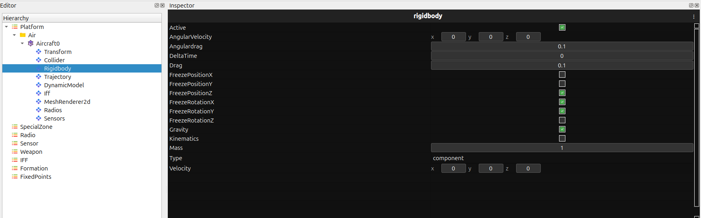
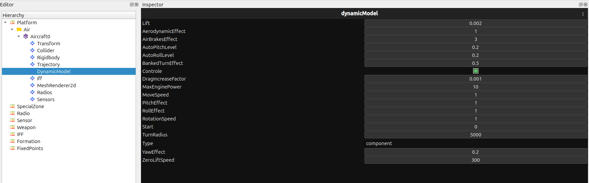
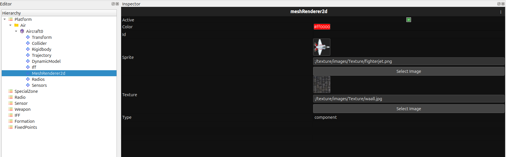
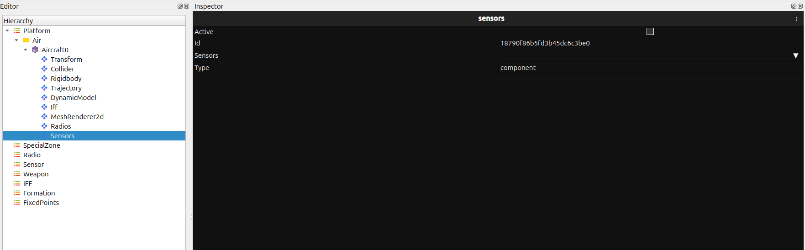
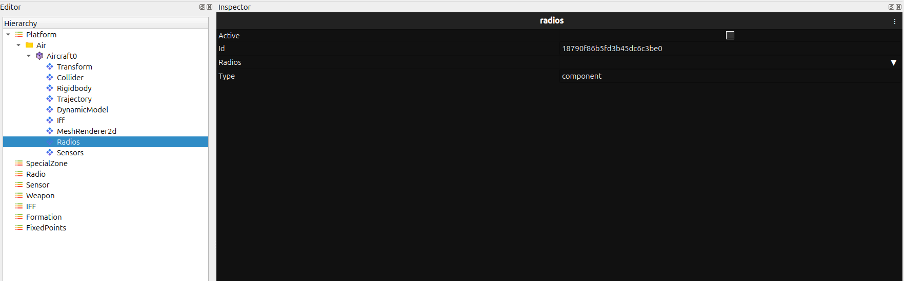
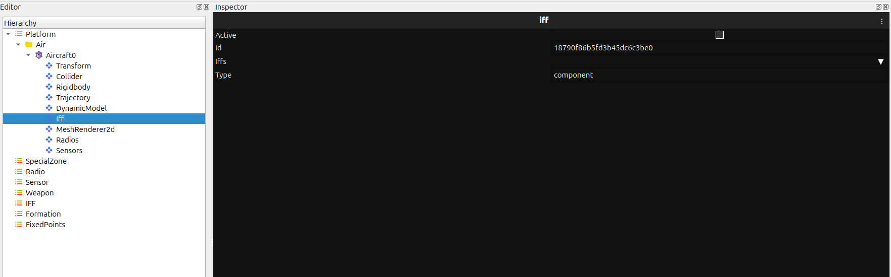
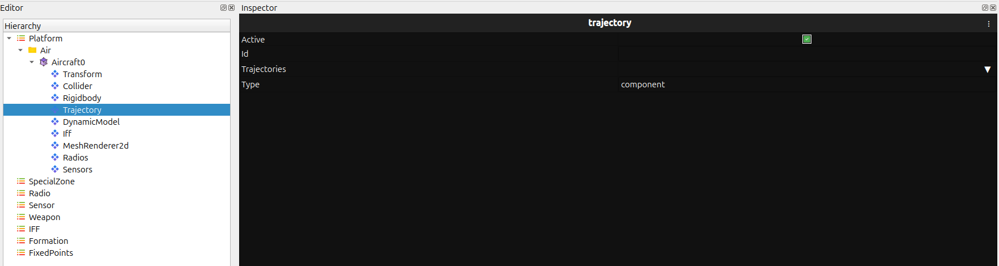

Inspector Overview
==================

The **Inspector Panel** displays detailed properties and configuration values of the selected entity.  
When a user selects an entity from the **Hierarchy Panel**, all its component data—such as model 
properties, physics parameters, sensors, radios, IFF, trajectory, and more—is shown here.

This panel allows users to **view, edit, and fine-tune every parameter** associated with the entity.

Aircraft0_self
~~~~~~~~~~~~~~

Properties of the main entity instance:

- Active  
- Branch  
- Id  
- Iffs  
- Name  
- Parent id  
- Radios  
- Sensors  
- Type  

Transform
---------

The **Transform** component controls the spatial and orientation properties of the entity:

- Active
- Geocord  
  - Lat  
  - Lon  
  - Alt  
  - Head
- Id
- Position  
  - x  
  - y  
  - z
- Rotation  
  - x  
  - y  
  - z
- Size  
  - x  
  - y  
  - z
- Type  

Collider
--------

   
The **Collider** component defines the physical collision boundaries of the entity:

- Active  
- Collider (dropdown)  
- Height  
- Length  
- Radius  
- Type  
- Width  

RigidBody
---------

The **RigidBody** component defines motion physics:

- Active  
- AngularVelocity  
  - x  
  - y  
  - z
- AngularDrag  
- DeltaTime  
- Drag  
- FreezePositionX  
- FreezePositionY  
- FreezePositionZ  
- FreezeRotationX  
- FreezeRotationY  
- FreezeRotationZ  
- Gravity  
- Kinematics  
- Mass  
- Type  
- Velocity  
  - x  
  - y  
  - z

DynamicModel
------------

The **DynamicModel** component defines aerodynamic and control behavior:

- Lift  
- AerodynamicEffect  
- AirBrakesEffect  
- AutoPitchLevel  
- AutoRollLevel  
- BankedTurnEffect  
- Control  
- DragIncreaseFactor  
- MaxEnginePower  
- MoveSpeed  
- PitchEffect  
- RollEffect  
- RotationSpeed  
- StartTurnRadius  
- TurnRadius  
- Type  
- YawEffect  
- ZeroLiftSpeed  

MeshRenderer2D
--------------

The **MeshRenderer2D** component controls visual appearance:

- Active  
- Color  
- Id  
- Sprite  
- Texture  
- Type  

Sensors
-------

- Active  
- Id  
- Sensors  
- Type  

Radios
------

- Active  
- Id  
- Radios  
- Type  

IFF
---

- Active  
- Id  
- Iffs  
- Type  

Trajectory
----------

- Active  
- Id  
- Type  

