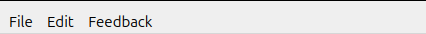
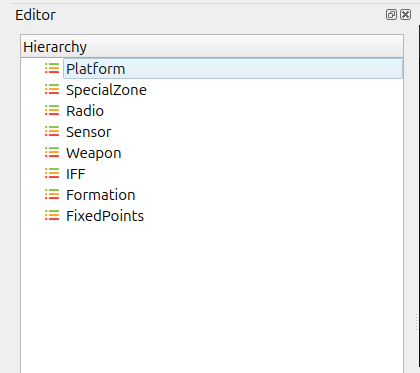
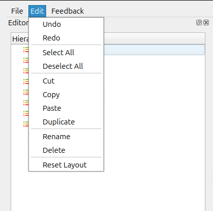

Menu Bar Overview
=================

The application includes a standard Menu Bar at the top of the interface.  
It provides access to key operations through the **File**, **Edit**, and **Feedback** menus.

File Menu
---------

   
The File menu provides options for creating, opening, saving, and closing files.

.. list-table::
   :header-rows: 1
   :widths: 20 60

   * - **Menu Item**
     - **Description**
   * - New File
     - Creates a new project or document.
   * - Recent Project
     - Displays a list of previously opened projects.
   * - Open File
     - Opens an existing file from the system.
   * - Open File to Library
     - Imports an external file into the application's library.
   * - Save
     - Saves the current file.
   * - Save As
     - Saves the file with a new name or at a different location.
   * - Exit
     - Closes the application.

Edit Menu
---------

The Edit menu provides essential editing and layout-related functions.

.. list-table::
   :header-rows: 1
   :widths: 20 60

   * - **Menu Item**
     - **Description**
   * - Undo
     - Reverses the last action performed.
   * - Redo
     - Re-applies an action that was undone.
   * - Cut
     - Removes the selected item and places it on the clipboard.
   * - Copy
     - Copies the selected item to the clipboard.
   * - Paste
     - Inserts clipboard content at the selected position.
   * - Select All
     - Selects all items in the active view.
   * - Deselect All
     - Removes selection from all currently selected items.
   * - Duplicate
     - Creates a copy of the selected item(s).
   * - Rename
     - Allows renaming of the selected item.
   * - Reset Layout
     - Restores the default window and panel layout.

