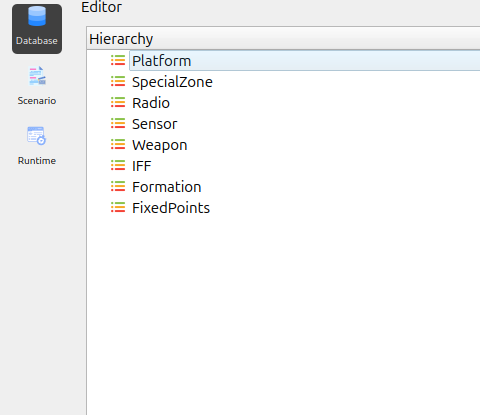

Navigation Panel Overview
=========================

The application features a **Navigation Panel** located on the left side of the interface.
This panel provides quick access to the primary operational modules of the system.
Each button in the panel switches the workspace to a specific editor or environment.

The Navigation Panel includes the following modules:

1. Database
-----------

Selecting **Database** opens the **Database Editor**.

This module is responsible for managing all foundational data used in the system, including:

- platforms  
- sensors  
- weapons  
- IFF configurations  
- and other core components  

It serves as the central workspace for creating, modifying, and organizing database entities.

2. Scenario
-----------

Selecting **Scenario** switches the interface to the **Scenario Editor**.

This module enables users to:

- create and configure mission scenarios  
- place entities on the map  
- define behaviors  
- set operational parameters  

It provides tools for building and customizing the overall simulation environment.

3. Runtime
----------

Selecting **Runtime** transitions the application to the **Runtime View**.

This environment is used to:

- execute the simulation  
- monitor system behavior  
- observe interactions in real time  
- validate operational workflows  

Users can track scenario dynamics and assess simulation performance directly within this view.

