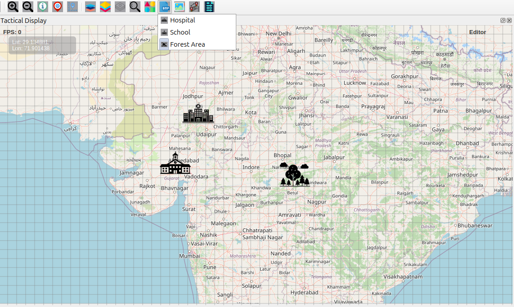
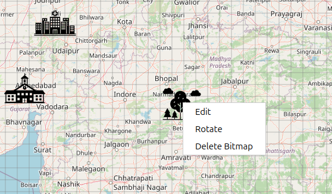

Bitmap Features User Guide
==========================

Bitmap Icon Overview
--------------------

The **Bitmap** button allows you to place preset icons and custom images on the
map for visual markers, points of interest, and custom annotations.

How to Use Bitmaps
~~~~~~~~~~~~~~~~~~

**Accessing Bitmap Tools**

1. Click the **Bitmap** icon on the **Design Toolbar**  
2. A dropdown menu appears with preset bitmap options  
3. Select the bitmap type you want to place  
4. The cursor changes to a crosshair, indicating placement mode  

Available Preset Bitmaps
~~~~~~~~~~~~~~~~~~~~~~

**Hospital** 

- Medical facilities and health services  
- Emergency medical locations  
- Health infrastructure markers  

**School**

- Educational institutions  
- Learning centers  
- Academic facilities  

**Forest Area** 

- Wooded regions  
- Natural reserves  
- Environmental zones  
- Park and recreation areas  

Placing Bitmaps on Map
~~~~~~~~~~~~~~~~~~~~~~

**Placement Process**

1. Select the bitmap type from the dropdown menu  
2. Click on the map at the desired location  
3. The bitmap appears immediately at the clicked position  
4. System automatically returns to **Move Mode** after placement  

Bitmap Management & Editing
~~~~~~~~~~~~~~~~~~~~~~~~~~~

**Selecting Bitmaps**

- Switch to **Move Mode** (hand icon)  
- Click directly on any bitmap to select it  
- Selected bitmaps can be moved or edited  

**Moving Bitmaps**

- Select a bitmap in **Move Mode**  
- Click and drag to reposition  
- Coordinates update in real time during movement  

**Editing Bitmaps (Right-Click Menu)**

Right-click any bitmap for the following options:

- **Edit** – Enter edit mode with resize handles  
- **Rotate** – Activate rotation handles for orientation  
- **Delete Bitmap** – Permanently remove the bitmap  

**Resizing Bitmaps**

1. Right-click the bitmap → **Edit**  
2. Resize handles appear at corners  
3. Drag handles to adjust size  
4. Aspect ratio remains locked during resizing  
5. Click outside the bitmap to exit edit mode  

**Rotation**

1. Right-click the bitmap → **Rotate**  
2. A rotation handle (yellow circle) appears  
3. Drag the handle to rotate the bitmap  
4. A visual rotation guide is displayed  
5. Smooth rotation feedback shows angle changes  

