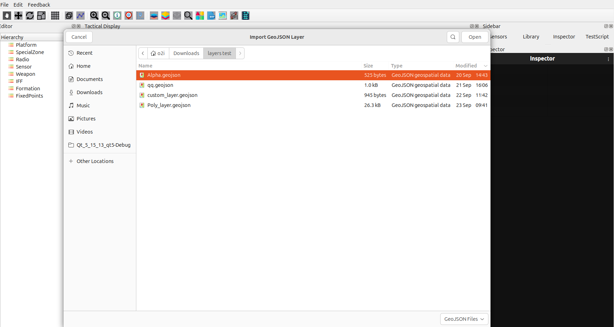
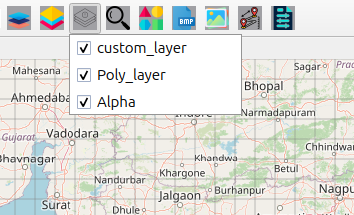

Import GeoJSON Features User Guide
==================================

Import GeoJSON Icon Overview
----------------------------

The **Import GeoJSON** button allows you to add custom geographic data layers
to your map from GeoJSON files, enabling you to visualize points, lines, polygons,
and other vector data.

Supported File Formats
~~~~~~~~~~~~~~~~~~~~~~

- **GeoJSON** (``.geojson``, ``.json``)
- **JSON** files with GeoJSON structure
- **GeoJSONL** (Line-delimited GeoJSON)
- **TopoJSON** (``.topojson``)

How to Import GeoJSON Files
---------------------------

Step-by-Step Import Process
~~~~~~~~~~~~~~~~~~~~~~~~~~~

1. Click the **Import GeoJSON** icon on the **Design Toolbar**
2. A file dialog opens — navigate to your GeoJSON file
3. Select the file and click **Open**
4. The layer automatically loads and appears on your map
5. The layer name is derived from the filename

Automatic Layer Management
~~~~~~~~~~~~~~~~~~~~~~~~~~

- Layer is automatically visible after import  
- Added to **GeoJSON Layers** menu for management  
- Appears in the layer visibility controls  
- Supports multiple GeoJSON layers simultaneously  

Managing GeoJSON Layers
~~~~~~~~~~~~~~~~~~~~~~~

**Layer Visibility Control**

1. Click the **GeoJSON Layers** button (layers icon)  
2. A dropdown menu shows all imported GeoJSON layers  
3. Check the box to **show** a layer  
4. Uncheck the box to **hide** a layer  
5. Multiple GeoJSON layers can be visible at once  

