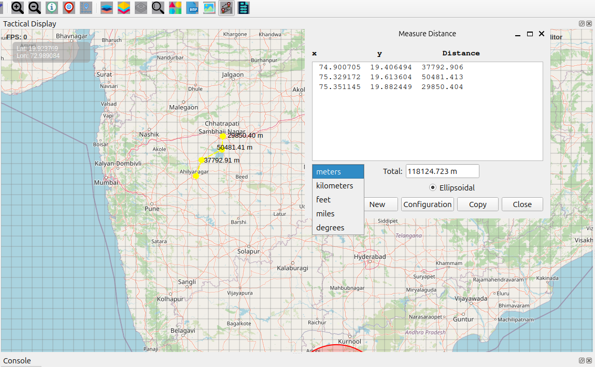

Measure Distance Features User Guide
====================================

Measure Distance Icon Overview
------------------------------

The **Measure Distance** button allows you to accurately measure distances
between points on the map using multiple calculation methods and unit options.
Ideal for planning, analysis, and operational measurements.

How to Use Measure Distance
---------------------------

Starting Measurement
~~~~~~~~~~~~~~~~~~~~

1. Click the **Measure Distance** icon on the **Design Toolbar**  
2. The cursor changes to a crosshair, indicating measurement mode  
3. The Measurement dialog opens automatically  
4. You are now ready to begin measuring  

Measurement Process
~~~~~~~~~~~~~~~~~~~

1. Click on the map to set a start point  
2. Continue clicking to add measurement points  
3. Segments automatically connect between points  
4. Real-time distance updates appear in the dialog  
5. Double-click or press **ESC** to finish  

Measurement Dialog Features
---------------------------

Segments Display
~~~~~~~~~~~~~~~~

- List of all measurement legs  
- Formatted columns for readability:  
  - **X coordinate** (longitude)  
  - **Y coordinate** (latitude)  
  - **Distance** for each segment  
- Displayed in monospaced font for perfect column alignment  

Total Distance
~~~~~~~~~~~~~~

- Running total of all segments  
- Automatic unit conversion  
- Appears as a read-only field for quick reference  

Measurement Options
-------------------

Calculation Methods
~~~~~~~~~~~~~~~~~~~~

**Ellipsoidal (Recommended — Default)**  
- High accuracy for long distances  
- Uses the WGS84 ellipsoid model  
- Accounts for Earth's curvature  
- Best for: **Large areas, geographic-scale measurements**

**Cartesian**  
- Faster calculation  
- Flat-plane geometry  
- Suitable for small areas  
- Best for: **Local measurements, quick estimates**  

Unit Selection
~~~~~~~~~~~~~~

- **Meters** (default) — Base unit  
- **Kilometers** — Long-distance measurements  
- **Feet** — Imperial unit  
- **Miles** — Road-distance measurements  
- **Degrees** — Angular/geographic coordinate distances  

