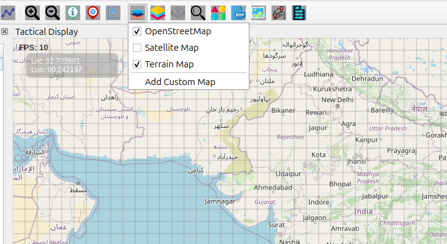

Map Layer Icon Overview
=======================

The **Map Layer** button provides complete control over map display
layers, allowing you to customize your mapping experience with multiple
data sources and visualizations.

Available Map Layers
--------------------

Built-in Layers
~~~~~~~~~~~~~~~

- **OpenStreetMap** – Standard street and road maps  
- **Satellite Map** – High-resolution aerial imagery  
- **Terrain Map** – Topographic and elevation data  

How to Use Map Layers
---------------------

Accessing Layer Controls
~~~~~~~~~~~~~~~~~~~~~~~~

- Click the **Map Layer** icon on the **Design Toolbar**  
- A dropdown menu appears showing all available layers  
- Check the box to show a layer  
- Uncheck to hide a layer  
- Multiple layers can be visible simultaneously  
- Adjust zoom using ``+`` and ``-`` buttons or the mouse scroll wheel (0–11 zoom levels)  

