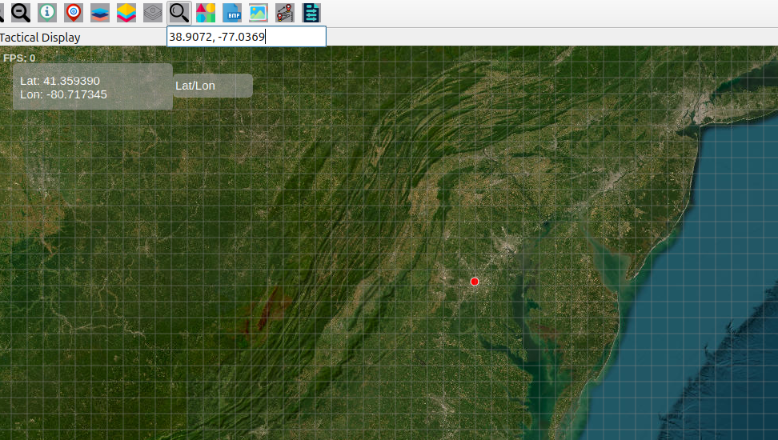

Search Place Features User Guide
================================

Search Place Icon Overview
--------------------------

The **Search Place** button allows you to quickly find and navigate to any
location on the map by name or coordinates. It supports both place-name searches
and direct latitude/longitude lookup.

How to Use Search
-----------------

Accessing Search
~~~~~~~~~~~~~~~~

1. Click the **Search Place** icon on the **Design Toolbar**  
2. A search box dropdown appears  
3. Enter your search term or coordinates  
4. Press **Enter** or **Return** to execute the search  

Search Methods
~~~~~~~~~~~~~~

1. **Place Name Search**  
   Enter any location name, for example:  
   - ``Delhi``  

2. **Coordinate Search**  
   Enter coordinates in decimal format:  
   - ``40.7128, -74.0060`` (latitude, longitude)  
   - Uses ``lat, lon`` format separated by a comma  

Search Results & Actions
------------------------

Automatic Map Navigation
~~~~~~~~~~~~~~~~~~~~~~~~

- Map automatically centers on the search result  
- Zoom level adjusts based on place importance:  
  - **Countries:** Zoom level 6  
  - **States/Regions:** Zoom level 7  
  - **Cities:** Zoom level 8  
  - **Towns/Villages:** Zoom level 9  

Visual Indicators
~~~~~~~~~~~~~~~~~

- A **red marker** is placed at the search location  
- A **geographic outline** is displayed for area-type features  
- Coordinates are shown in the **information panel**  

   
  **Fig:1. Search by place**
 
 .. image:: ../../../images/search_place.png
    :alt: search place
    :align: center
    :width: 500
   
  **Fig:2. Search by coordinates**
