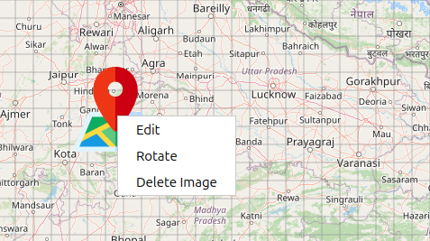

Select Bitmap Image Features User Guide
=======================================

Select Bitmap Image Icon Overview
---------------------------------

The **Select Bitmap Image** button allows you to upload and place your own
custom images on the map, providing complete flexibility for marking locations with
company logos, specialized icons, or any visual markers you need.

How to Use Select Bitmap Image
------------------------------

Accessing the Feature
~~~~~~~~~~~~~~~~~~~~~

1. Click the **Select Bitmap Image** icon on the **Design Toolbar**  
2. A file selection dialog opens immediately  
3. Navigate to and select your image file  
4. Click **Open** to place the image  

Supported File Formats
~~~~~~~~~~~~~~~~~~~~~~

- **PNG** (``.png``) — *Recommended (supports transparency)*  
- **JPEG/JPG** (``.jpeg``, ``.jpg``) — *Standard photo formats*  

Placing Custom Images
---------------------

Automatic Placement
~~~~~~~~~~~~~~~~~~~

- Image is automatically centered on your current map view  
- No need to click the map — placement is instant  
- Ideal for precise positioning by adjusting the map beforehand  

Managing Custom Images
----------------------

Selecting Custom Images
~~~~~~~~~~~~~~~~~~~~~~~

- Switch to **Move Mode** (hand icon)  
- Click directly on your custom image to select it  
- Selected images become active for editing  

Moving Custom Images
~~~~~~~~~~~~~~~~~~~~

- Select image in **Move Mode**  
- Click and drag to reposition anywhere on the map  
- Real-time coordinate tracking during movement  

Editing Custom Images (Right-Click Menu)
~~~~~~~~~~~~~~~~~~~~~~~~~~~~~~~~~~~~~~~~

Right-click any custom image for the following options:

- **Edit** – Enter edit mode with resize handles  
- **Rotate** – Activate rotation handles for orientation adjustment  
- **Delete Image** – Permanently remove the image from the map  

Resizing Custom Images
~~~~~~~~~~~~~~~~~~~~~~

1. Right-click the image → **Edit**  
2. Four resize handles appear at the corners  
3. Drag any handle to adjust size proportionally  
4. The original aspect ratio is preserved automatically  
5. Click outside the image to exit edit mode  

Rotation
~~~~~~~~

1. Right-click the image → **Rotate**  
2. A rotation handle (yellow circle) appears  
3. Drag the handle to rotate the image to the desired angle  
4. Smooth rotation with visual angle feedback  
5. Perfect for aligning images with map features or roads  

