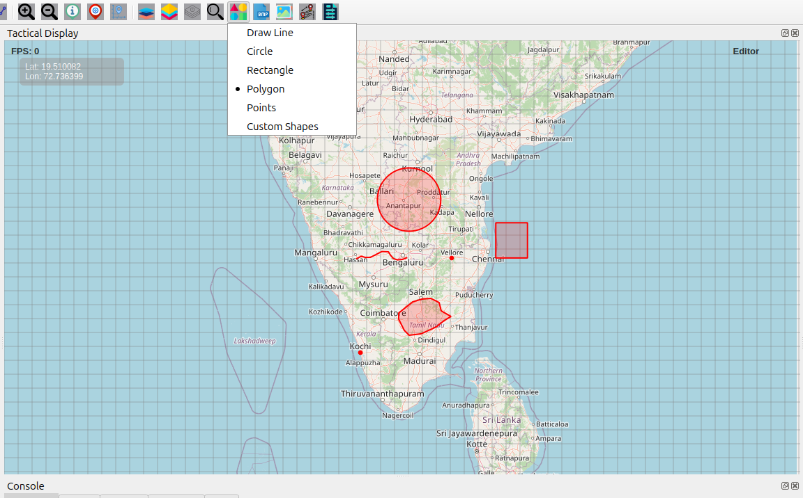
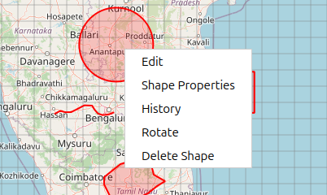
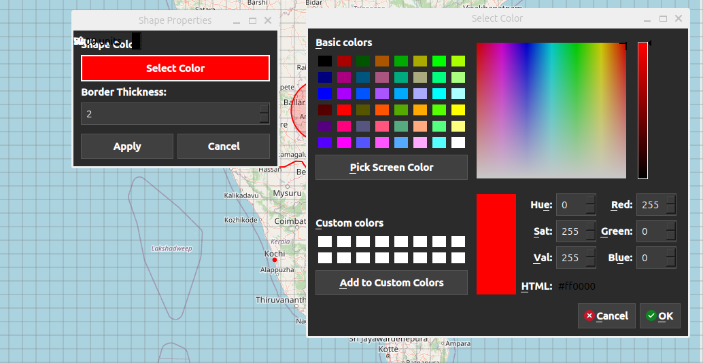
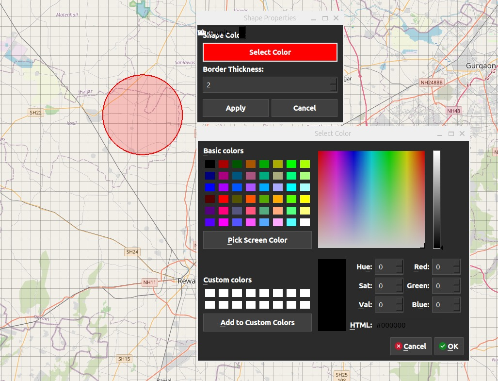
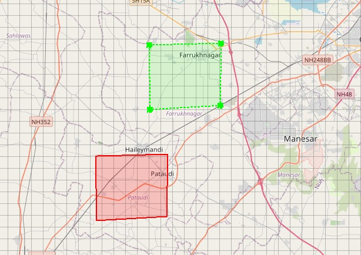
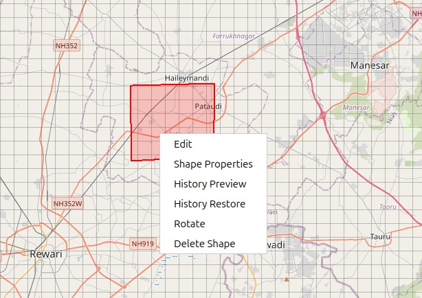

Shape Drawing Features User Guide
=================================

Shape Icon Overview
-------------------

The **Shape** button allows you to draw various geometric shapes and lines
directly on the map for marking areas, creating boundaries, and visualizing spatial
relationships.

How to Draw Shapes
------------------

Accessing Shape Tools
~~~~~~~~~~~~~~~~~~~~~

1. Click the **Shape** icon on the **Design Toolbar**  
2. A dropdown menu appears with all available shape types  
3. Select the shape you want to draw  
4. The cursor changes to a crosshair, indicating drawing mode  

Available Shape Types
~~~~~~~~~~~~~~~~~~~~~

**Draw Line**  
- Creates multi-segment connected lines  
- Usage:  
  - Click to place each vertex  
  - Continue clicking to add segments  
  - Double-click to finish  
  - Press **ESC** to cancel  

**Circle** 
- Creates circular areas with a defined radius  
- Usage:  
  - Single click to place the center  
  - Circle is created with default size  
  - Automatically exits drawing mode  

**Rectangle**  
- Creates rectangular areas  
- Usage:  
  - Single click to place rectangle  
  - A default-sized rectangle is created  
  - Automatically exits drawing mode  

**Polygon** 
- Creates multi-sided closed shapes  
- Usage:  
  - Click to place each vertex  
  - Continue clicking to add sides  
  - Double-click to close and finish  
  - Press **ESC** to cancel  

**Points**  
- Creates individual point markers  
- Usage:  
  - Click to place each point  
  - Every click creates a new point  
  - Stays in drawing mode until manually exited  

   
 Figure: Different shapes  
   
Shape Management & Editing
--------------------------

Selecting Shapes
~~~~~~~~~~~~~~~~

- Switch to **Move Mode** (hand icon)  
- Click any shape to select it  
- Selected shapes display a selection outline  

Moving Shapes
~~~~~~~~~~~~~

- Select the shape in **Move Mode**  
- Click and drag to reposition  
- Coordinates update in real time  

Editing Shapes (Right-Click Menu)
~~~~~~~~~~~~~~~~~~~~~~~~~~~~~~~~~

Right-click any shape for the following options:

- **Edit** – Enter edit mode with resize handles  
- **Shape Properties** – Change color and border thickness  
- **History** – View movement history with green outlines  
- **Rotate** – Enable rotation handles  
- **Delete Shape** – Permanently remove the shape  

   
  Figure : Shape Dialog
   

     
  Figure : Shape Property
   
Resizing Shapes
~~~~~~~~~~~~~~~

1. Right-click the shape → **Edit**  
2. Resize handles appear at edges and corners  
3. Drag handles to resize  
4. Click outside the shape to exit edit mode  

Shape Properties
~~~~~~~~~~~~~~~~

1. Right-click on any shape and select Shape Properties to customize its appearance.
2. Border Color – Change the shape’s border color using the color picker.
3. Border Thickness – Adjust the thickness of the shape’s border.

   
History Preview, Restore & Hide
~~~~~~~~~~~~~~~~~~~~~~~~~~~~~~~

History Preview
~~~~~~~~~~~~~~~
When a user drags, resizes, or rotates any shape, all previous states are automatically saved in the shape history.

1. Drag any shape on the map
2. Right-click on the same shape.
3. Select History Preview
4. Previous positions, sizes, and rotations are displayed as outline previews on the map
5. The current shape remains unchanged while previewing history

   
History Restore
~~~~~~~~~~~~~~~

If the user wants to revert the shape to a previous position or size:

1. Right-click the shape
2. Select History Restore
3. Choose a previous history state
4. The shape is restored to the selected position, size, and rotation

   
Hide History Preview
~~~~~~~~~~~~~~~~~~~~
To remove history visuals from the map:

1. Right-click the shape
2. Select Hide Preview
3. All history outline previews are hidden
4. The shape remains in its current state

Rotation
~~~~~~~~
1. Right-click the shape → **Rotate**  
2. A rotation handle appears  
3. Drag the handle to rotate the shape  
4. A visual rotation guide is displayed  

