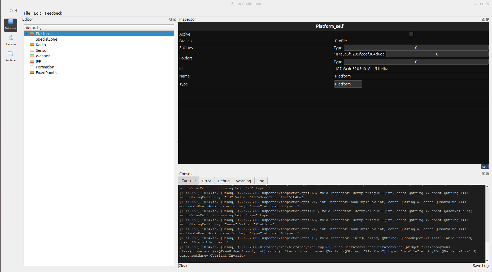

Database Editor overview
==============================

You use the Database Editor to build a database of profiles (Platform, Sensor, Weapon, Radio, IFF, Formation, SpecialZone, FixedPoints, etc.) that you will then use to create the actual objects you add to a scenario in the Scenario Editor.

To build a database, you can do one of the following:

1.Create a new database starting from the default set of profile categories.
2.Open an existing database.

You can then create and/or customize profiles in each of the profile categories in the editor’s Database Tree pane (left side).
You can also load  databases into the Database Editor. 
When you select an item in the Database Tree (for example, “Platform” , its properties appear in the Object Inspector pane, which is by default on the right side of the Database Editor.
The bottom Console pane displays real-time Debug, Warning, Error, and Log messages, with Clear and Save Log options for troubleshooting.
For more information about the Database Editor

   

