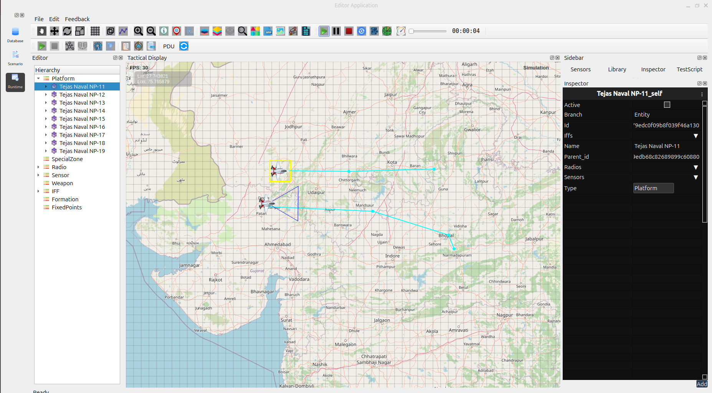

Runtime Environment overview
==============================

By default, the RuntimeEnv window displays the scenario you are currently working on in the Scenario Editor, although you can open other File, select the one you want to display.

Once loaded, you can run the scenario and monitor how the entities behave and react within it. Using controls on the Runtime toolbar, you can start, stop, pause, the scenario.

   

