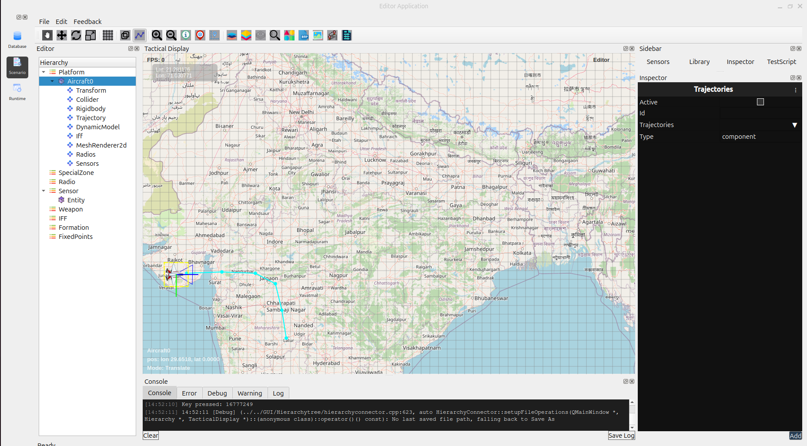

Scenario Editor overview
==============================

Once you have built a database of profiles, you use the Scenario Editor to build a scenario . The Scenario Editor includes the Tactical Display in which you define a gaming area, designate special zones, position your entities, plot their trajectories (including waypoints), and assign dynamic models. You can customize each of the entities within the scenario based on their profiles as defined in the database.

   

