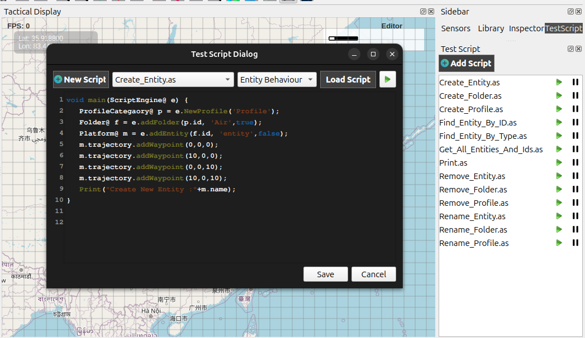

Script Editor overview
==============================

Scripts in the Scenario Editor are used to control entity behaviour, automate scenario actions, and quickly test custom logic during a simulation run.They can be created, loaded, saved, and executed directly from the Test Script panel and script dialog, allowing rapid experimentation with entity logic and scenario operations.

   

