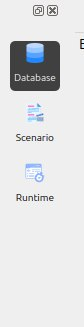
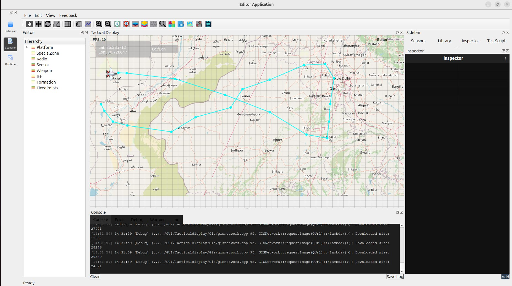
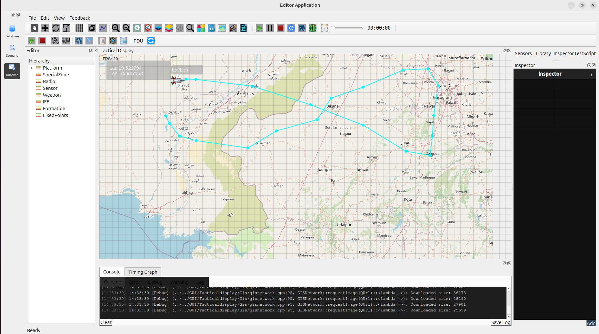
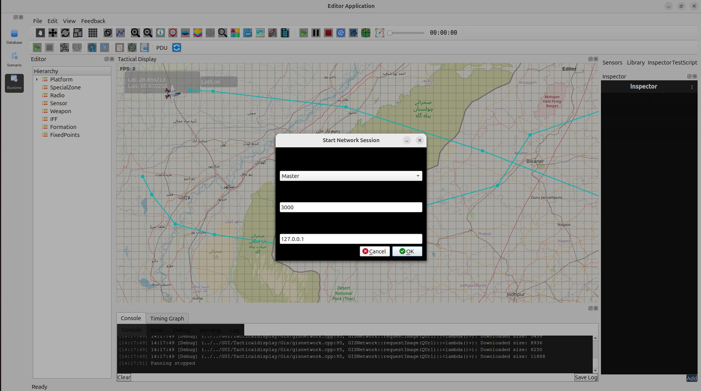
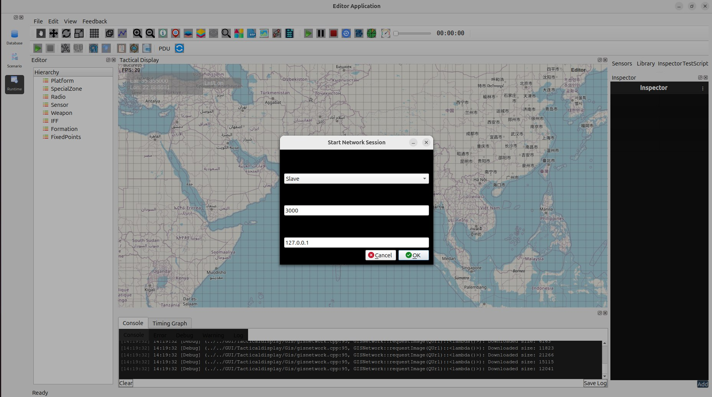

Network Module
==============

The Network module enables multi-system synchronized simulation, where one machine operates as the **Master** and additional machines connect as **Slaves**.

When a Slave connects, it automatically receives the complete scenario state from the Master, including:

- Folders  
- Entities  
- Scenario initialization  
- Runtime updates  

All simulation updates performed on the Master are broadcast to all connected Slaves in real time.

**Note:**  
Network settings apply *only* to the scenario currently running in the Runtime environment.

Setting Up a Network Session
----------------------------

1. Load the Database
~~~~~~~~~~~~~~~~~~~~

Before starting a network session, load the required database.

Steps:

1. Open the **Database Editor**.
2. Load or edit the database as needed.
3. Switch to the **Scenario module**.

2. Load or Create a Scenario
~~~~~~~~~~~~~~~~~~~~~~~~~~~~

You may either:

- Create a new scenario in the Scenario Editor  
  **OR**
- Load an existing scenario

**Important — Save the Scenario**

Before switching to Runtime, save your scenario:

- `File → Save Scenario`  
  **or**
- Use the Save button in the toolbar

This ensures that the Runtime environment loads the correct scenario.

3. Switch to Runtime
~~~~~~~~~~~~~~~~~~~~

1. Click the **Runtime** tab.
2. The scenario will load into the Runtime environment.
3. Runtime supports simulation execution and network synchronization.

4. Start as Master
~~~~~~~~~~~~~~~~~~

On the machine that will **control** the simulation:

1. Open the **Start Network Session** dialog.
2. Set **Role = Master**.
3. Enter the **Port** (e.g., `3000`).
4. Enter the **IP address** to listen on (e.g., `127.0.0.1`).
5. Click **OK**.

What happens now:

- The Master begins listening for Slave connections.
- Master becomes the authoritative controller of the simulation.

5. Start as Slave
~~~~~~~~~~~~~~~~~

On the second machine (or another instance):

1. Open the **Start Network Session** dialog.
2. Set **Role = Slave**.
3. Enter the same **Port** used by the Master.
4. Enter the **Master’s IP address**.
5. Click **OK**.

Upon successful connection, the Slave automatically receives:

- Folders  
- Entities  
- Scenario configuration  
- Runtime instances  

The Slave display becomes fully synchronized with the Master simulation.

6. Run the Simulation
~~~~~~~~~~~~~~~~~~~~~

Once the Slave is connected:

- Start the simulation from the **Master**.
- All movements, updates, and runtime actions are immediately reflected on the Slave.
- The Slave **cannot** control the simulation — it only mirrors the Master.

Network Workflow Summary
------------------------

.. list-table::
   :header-rows: 1
   :widths: 10 40 20

   * - Step
     - Action
     - Performed On
   * - 1
     - Load Database
     - Database Editor
   * - 2
     - Load / Create Scenario
     - Scenario Editor
   * - 3
     - Switch to Runtime
     - Runtime Tab
   * - 4
     - Start as Master
     - Machine A
   * - 5
     - Start as Slave
     - Machine B
   * - 6
     - Run Simulation
     - Master Only

