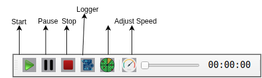

Runtime Toolbar 
==================

**Start** - Button to start recording

**Pause** - Button to temporarily pause recording

**Stop** - Button to completely stop recording

**Logger** - Name of the data recording or event tracking system

**Adjust Speed** - Control to make recording speed faster or slower

