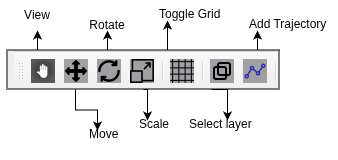
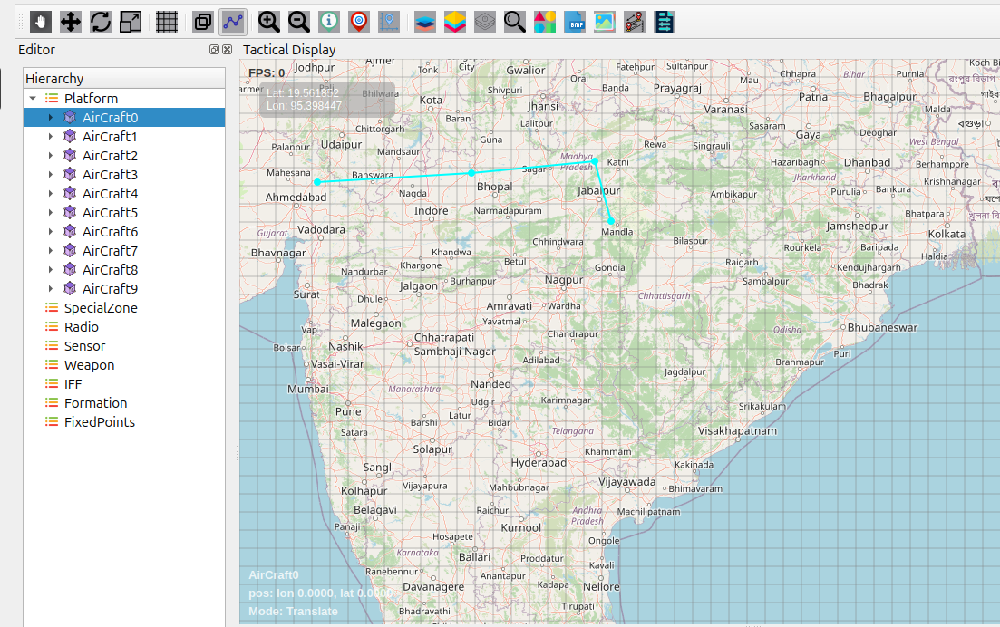
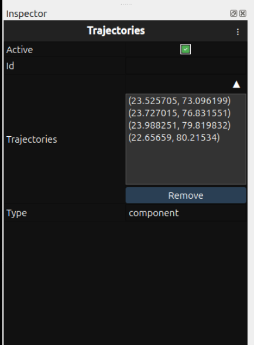
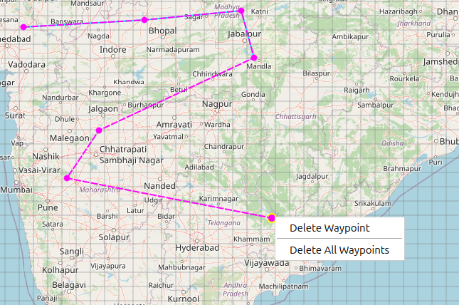

Trajectory and waypoints
==============================

   
1. Trajectory Overview 

The Add Trajectory feature enables users to create and manage movement paths for entities on the map. Custom trajectories with multiple waypoints can be drawn to define precise movement routes. 

2. How to Create Trajectories 

2.1. Accessing Trajectory Tools  

Select an entity in the Hierarchy panel  

Click the Add Trajectory icon on the Design Toolbar  

Ready to draw the trajectory path 

2.2. Drawing Process  

Click on map to place first waypoint  

Continue clicking to add subsequent waypoints  

Automatic line connection between waypoints  

Visual path displays complete trajectory  

Press ESC key to exit drawing mode 

3. Trajectory Management 

3.1. Viewing Trajectory Data  

Select entity with trajectory in Inspector  

Click Trajectory component in entity properties  

Waypoint coordinates displayed in Inspector panel  

Coordinate format: (latitude, longitude) 

3.2. Trajectory Inspector Display 

The Trajectory component shows:  

Active status toggle  

Trajectory ID  

Type information  

Waypoint list with coordinates 

3.3. Removing Trajectories  

Select trajectory by clicking on it

Right-click on trajectory path

Choose from two removal options:

Delete  Waypoint - Removes only selected waypoint

Delete All Waypoints - Removes entire trajectory path

Trajectory permanently deleted from entity 

4. Right-Click Menu Features 

4.1. Delete All Waypoints  

Removes entire trajectory path completely  

All waypoints deleted at once  

Trajectory becomes empty (no path)  

Entity retains trajectory component without waypoints 

4.2. Delete Selected Waypoint  

Removes only currently selected waypoint  

Other waypoints remain intact  

Automatic trajectory path adjustment  

Ideal for fine-tuning specific route sections 

