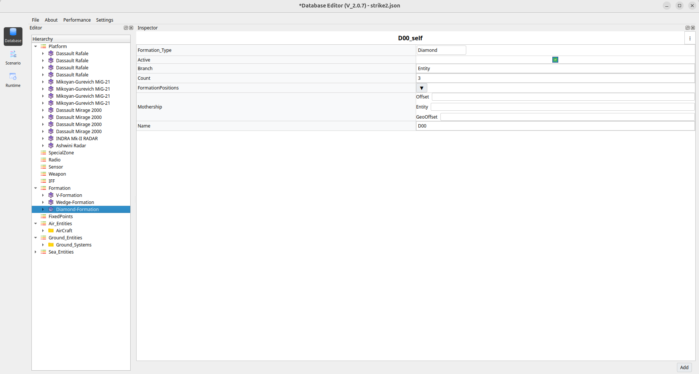
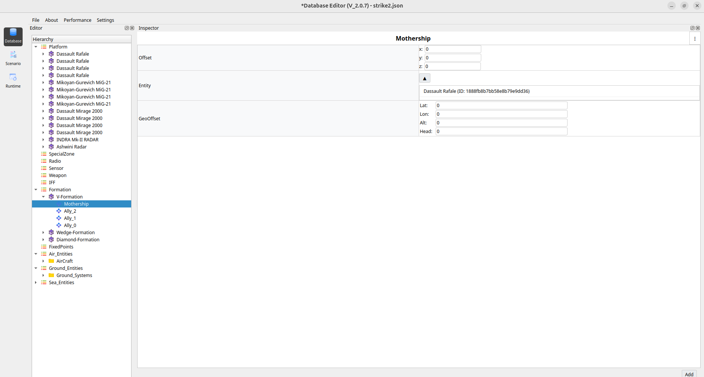

Formation Creation and Configuration Guide
===========================================

This section explains how to create and configure aircraft formations using the
Hierarchy and Inspector panels.

--------------------------------
1. Add Entities
--------------------------------

Before creating a formation, ensure that the required entities exist.

- Add entities under the **Platform** node (for example: ``Tejas``, ``Mig``, ``Rafale``).
- These entities will later be assigned as **Mothership (Leader)** and
  **Allies (Followers)**.

--------------------------------
2. Create a Formation
--------------------------------

1. In the **Hierarchy** panel, right-click on **Formation**.
2. Select **Add Formation**.
3. A new formation (for example: ``V-Formation``) will appear under the
   **Formation** node.

--------------------------------
3. Configure Formation
--------------------------------

1. Click the newly created **Formation**.
2. In the **Inspector** panel, configure the required fields.

**Required Fields**

- **Count**

  - Enter the number of followers (Allies) required in the formation.
  - Example: ``2`` → creates ``Ally_0`` and ``Ally_1``.

- **Formation Type**

  - Select the desired formation type (for example: ``V``).

Once **Count** and **Formation Type** are set, the system automatically creates:

- ``Mothership``
- ``Ally_0``, ``Ally_1``, … ``Ally_N``

These objects appear under the formation node in the **Hierarchy** panel.

    
--------------------------------
4. Assign Mothership (Leader)
--------------------------------

1. Click **Mothership** under the formation.
2. In the **Inspector** panel:

   - Locate the **Entity** field.
   - Drag an entity from the **Platform** section.
   - Drop it into the **Entity** field.

The selected entity now becomes the leader of the formation.

--------------------------------
5. Assign Allies (Followers)
--------------------------------

1. Click ``Ally_0``, ``Ally_1``, and so on, one by one.
2. For each ally:

   - Drag an entity from the **Platform** section.
   - Drop it into the **Entity** field in the **Inspector** panel.

Each ally follows the mothership according to the selected formation type.

